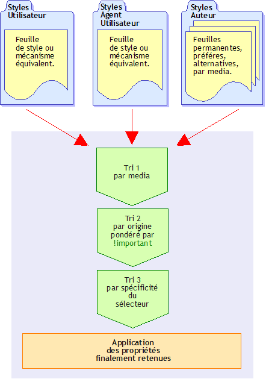
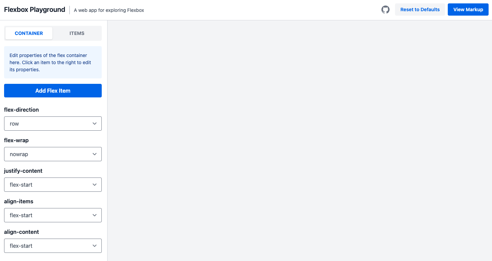

<!-- _paginate: skip -->
# CSS ?


- **HTML**: <span class='red'>Structuration</span>  (sémantique) de l'information
- **CSS**: Modifier la <span class='blue'>présentation</span> des balises HTML
    + Couleur et arrière-plan
    + Propriétés de typographie
    + Propriétés de texte
    + Propriétés du modèle de boite
    + Positionnement de ces boites

<!-- _footer: <span class='red'>*</span> M. PERREIRA DA SILVA -->

---
<!-- _paginate: skip -->
# [Version PDF des slides](pdf/css.pdf)

---
# Pourquoi ???
- <span class='green'>**Avantages**</span>
    + Séparation contenu (HTML) / mise en forme (CSS)
    + Meilleure lisibilité du code
    + C'est plus 'green' (mise en cache séparée du HTML et CSS)
    + Présentation homogène du site web
    + Maintenance facilitée : répercussion automatique des modifications
    + Compatible avec divers langages (HTML, XML, SVG, etc.)

- <span class='red'>**Inconvénients**</span>
    + Encore quelques différences de rendu entre les navigateurs
    + Certaines fonctionnalités récentes (CSS3/4) pas encore supportées par tous les navigateurs

---
# Un peu d'histoire...

- **1994**: Håkon Wium Lie & Bert bos établie le **concept des CSS**
    + 1er format à inclure l'idée de *cascade*
    + Un document peut hériter son style à partir de plusieurs *feuilles de style*.

- **1996**: CSS 1 (*W3C Recommendation*)
    + propriétés typographiques du texte mais **pas de mise en page**

- **1998**: CSS 2 (*W3C Recommendation*)
    + styles propres aux différents média (ex: `screen` et `print`)
    + nouvelles fonctionnalités de **positionnement des éléments**
    + chargement de polices de caractère spécifiques
    + possibilité de prendre en compte les préférences de l'utilisateur dans la mise en forme d'un site

---
# Un peu d'histoire...

- **1998**: CSS 2 (*W3C Recommendation*)
    + **spécifications incomplètes** rendant inimplémentables certaines fonctionnalités
    + **absence d'intérêt** de la part de concepteurs de navigateurs

- **2004** (*W3C Recommendation*) à **2011** (*W3C Proposed Recommendation*): CSS 2.1
    + **Simplifier CSS 2** et l'adapter aux pratiques généralement admises
    + Suppression des dispositifs CSS 2 rendus obsolètes par CSS 3
    + Très peu de nouvelles fonctionnalités

---
# Un peu d'histoire...

- **1999 à maintenant** : CSS (level) 3
    + **Modularisation** : chaque sous ensemble est standardisé séparément
    + Exemples de modules
        - Nouveaux sélecteurs
        - Média Queries
        - Gestion de la couleur
     + Actuellement, [prise en charge partielle](https://caniuse.com/) par les navigateurs

- **CSS 4 ?**
    + Seulement des modules CSS level 4

---
# Syntaxe

- On définit des **règles CSS**

    + **`selecteur { propriété_CSS : valeur; ..._}`**

- Exemple:

")

---
# Propriété : valeur;

- Une **propriété** est un mot réservé défini dans les normes

    + Exemples: `border`, `margin`, `padding`, `background`

- Les **valeurs** sont soit des

    + Unités normalisées

        - Exemple: `12px`

    + Mots clés

        - Exemple: `black`, `red`, `none`

---
# Les unités (CSS 2)

<div class='pure-g'>
<div class='pure-u-1-2'>

- **Unités absolues**
    + Pouce (2,54cm): `1.5 in`

    + Centimètre: `1.5 cm`

    + Millimètre: `1.5 mm`

    + Point (1/72 in): `1.5 pt`

    + Pica (12 pt): `1.5 pc`

</div>
<div class='pure-u-1-2'>

- **Unités relatives**

    + **Largeur de 'M'**: `1.5 em`

    + Hauteur de 'x': `1.5 ex`

    + **Pourcentage**: `1.5 %`

    + Pixel (résolution): `1.5 px`

</div>
</div>

<!-- _footer: <span class='red'>*</span> CSS 3 définit aussi des unités relatives au viewport dont nous reparlerons dans la partie responsive design : `vh`, `vw`, `vmin` et `vmax` -->
---
# Les couleurs

- Code <span class='red'>R</span><span class='green'>G</span><span class='blue'>B</span> **hexadécimal**
    + Exemple: `#FFFF00` (jaune)

- **Fonction** <span class='red'>R</span><span class='green'>G</span><span class='blue'>B</span>(A) et HSL(A)<span class='red'>*</span>
    + Exemple: `rgb(255,255,0)` (encore du jaune)
    + Exemple: `rgba(255,255,0,0.5)` (du jaune 50% transparent)
    + Exemple: `hsl(50,100%,50%)` (du jaune 50%)
    + Exemple: `hsla(50,100%,50%,0.5)` (du jaune 50% transparent)

- Noms **prédéfinis** (17 en CSS 2, 147 en CSS 3)
    + Exemples (CSS 2): aqua, black, blue, fuchsia, gray, green, lime, maroon, navy, olive, orange, purple, red, silver, teal, white, yellow

<!-- _footer: <span class='red'>*</span> La prise en compte de la transparence fait partie de CSS3 -->

---
# Les URL

- Certaines propriétés utilisent des **URL** comme valeur
	+ Ex: `background-image`
- On utilise alors la **fonction** `url()`
    + Ex: `body { background-image: url("http://www.example.fr/untruc.gif")`
    + Ex: `body { background-image: url(http://www.example.fr/untruc.gif) }`
- Les **URL relatives** sont acceptées
    + URL relative à l'URL de la feuille de style (pas de la page HTML) !	 
    + Ex: `body { background-image: url("./images/untruc.gif") }`

---
# Lier styles CSS et document HTML

- **Style en ligne** (à **VRAIMENT** éviter)
    + Attribut `style` des balises HTML
    + Pas de séparation fond / forme...

- Exemple:

    ```html
    <p style="color:red;"> Une phrase en rouge. </p>
    ```

---
# Lier styles CSS et document HTML

- **Feuille de style interne** (à éviter aussi)
    + Balise `<style></style>` dans la partie `<head>` de la page
    + On préférera écrire les règles CSS dans une feuille de style séparée

- Exemple:

    ```html
    <!DOCTYPE html>
    <html lang="fr">
      <head>
        <!-- on suppose que les balises obligatoires du header
        ont été déclarées plus haut -->
        <style>
            p { color: red;}
        </style>
      </head>
      <body> <p id="phrase_rouge"> Une phrase en rouge. </p> </body>
    </html>
    ```

---
# Lier styles CSS et document HTML

- **Feuille de style externe liée** (à privilégier)
    + Règles CSS dans un fichier externe
    + Lien avec la feuille de style via une balise `<link ... >` dans la partie `<head>` de la page
    + **Possibilité** de spécifier un média cible

- Exemple:

    ```html
    <!DOCTYPE html>
    <html lang="fr">
      <head>
        <!-- les balises obligatoires du header ont été déclarées + haut -->
        <!-- l'utilisation de media="screen" n'est pas obligatoire -->
        <link rel="stylesheet" href="mon_fichier.css" media="screen" >
      </head>
      <body> <p id="phrase_rouge"> Une phrase en rouge. </p> </body>
    </html>
    ```

---
# Le ciblage par média

- On peut spécifier le **média cible** de nos règles CSS
    + au liage / à l'import d'une feuille de style (*vu juste avant*)
    + au niveau des règles CSS, avec `@media type_media { /* code CSS */ }`
        - Exemple:
        
            ```css
            @media print {
                /* le menu n'est pas affiché à l'impression */
                #mon_menu { display: none;}
            }
            ```
- Types de média les plus courants
    + `all`: tous les supports
    + `screen`: moniteur couleur d'ordinateur
    + `print`: document destiné à être imprimé (voir aussi `@page`)
    + `projection`: projection :-)


---
# Sélecteurs simples

- `nomElement`: sélecteur de **balise**
    + Exemple:

        ```css
        p { color: red;} /* tous les paragraphes <p> */
        ```

- `.nomClasse`: sélecteur de **classe**
    + Exemple:
    
        ```css
        .maClasse { color: green;} /* les élements de la classe "maClasse" */
        ```

- `#identifiant`: sélecteur d'**ID**
    + Exemple:
    
        ```css
        #monId { color: blue;} /* l'élément ayant l'ID "monId" */
        ```

---
# Sélecteurs simples

- `*`: sélecteur **universel**
    + Exemple:
    
        ```css {1}
        * { color: orange;} /* tous les éléments */
        ```

- On peut **combiner** les sélecteurs
    + Exemple:
    
        ```css
        p.maClasse { color: lime; } /* tous les <p> de classe "maClasse" */
        ```

- On peut **grouper** les sélecteurs
    + Exemple:
    
        ```css
        /* tous les éléments de classe "maClasse1" ou "maClasse2" */
        .maClasse1, .maClasse2 { color: lime; } 
        ```

---
# Sélecteurs hiérarchiques

- `A B`: **Descendance**
    + B est un descendant quelconque de A
    + La règle s'applique à B !
+ Exemple:
<div class='pure-g'>
<div class='pure-u-1-2'>
<div class='center'>HTML</div>

```html
<section>
    <div>Div 1.
        <div>Div 2.</div>
    </div>
</section>
<div>Div 3.</div>
```
<div class='center'>CSS</div>

```css
div { background-color: whitesmoke; }
section div { background-color: yellow; }
```    
</div>
<div class='pure-u-1-2'>
Résultat:
<div class='resultat r1'>
    <style>
        .r1 div { background-color: whitesmoke;}
        .r1 section div { background-color: yellow; }
    </style>
    <section>
        <div>Div 1.
        <div>Div 2.</div>
        </div>
    </section>
    <div>Div 3.</div>
</div>   
</div>
</div>

---
# Sélecteurs hiérarchiques

- `A > B`: **Enfant**
    + B est un fils (direct) de A
    + La règle s'applique à B !
+ Exemple:
<div class='pure-g'>
<div class='pure-u-1-2'>
<div class='center'>HTML</div>

```html
<section>
    <div>Div 1.
        <div>Div 2.</div>
    </div>
</section>
<div>Div 3.</div>
```
<div class='center'>CSS</div>

```css
div { background-color: whitesmoke; }
section > div { background-color: yellow; }
```    
</div>
<div class='pure-u-1-2'>
Résultat:
<div class='resultat r2'>
    <style>
        .r2 div { background-color: whitesmoke;}
        .r2 .r2workaround { background-color: yellow; }
    </style>
    <section>
        <div class="r2workaround">Div 1.
            <div>Div 2.</div>
        </div>
    </section>
    <div>Div 3.</div>
</div>   
</div>
</div>

---
# Sélecteurs hiérarchiques

- `A + B`: **Frère adjacent**
    + B est au même niveau que A et le suit immédiatement
    + La règle s'applique à B !
+ Exemple:
<div class='pure-g'>
<div class='pure-u-1-2'>
<div class='center'>HTML</div>

```html
<section>
    <div>Div 1.
        <div>Div 2.</div>
    </div>
</section>
<div>Div 3.</div>
```
<div class='center'>CSS</div>

```css
div { background-color: whitesmoke; }
section + div { background-color: yellow; }
```    
</div>
<div class='pure-u-1-2'>
Résultat:
<div class='resultat r3'>
    <style>
        .r3 div { background-color: whitesmoke;}
        .r3 section + div { background-color: yellow; }
    </style>
    <section>
        <div>Div 1.
            <div>Div 2.</div>
        </div>
    </section>
    <div>Div 3.</div>
</div>   
</div>
</div>

---
# Les sélecteurs basés attribut

- `A[attr]`: L'élément **possède** l'attribut `attr` , **peu importe sa valeur**
    + Exemple:
    
        ```css
        /* tous les <input> qui possèdent un attribut 'type' */
        input[type]  { color: red; }
        ```

- `A[attr="val"]`: **La valeur** de l'attribut `attr` de l'élément est **exactement** `val`
    + Exemple:
    
        ```css
        /* tous les <input> dont l'attribut 'type' est 'button' */
        input[type='button']  { color: green; }
        ```

---
# Les sélecteurs basés attribut

- `A[attr~="val"]`: **L'une des valeurs** de l'attribut `attr` de l'élément est **exactement** `val`
    + Exemple:
    
        ```css
        /* tous les <div> dont l'une des valeurs de l'attribut 'class' est 'maClasse' */
        div[class~='maClasse']  { color: yellow; }
        ```

- `A[attr|="val"]`: **La valeur** de l'attribut `attr` de l'élément **commence par** `val`
    + Exemple:
    
        ```css
        /* tous les <input> dont l'attribut 'id' commence par 'btn' */
        /* Exemple: 'btn1', 'btn5', etc. */
        input[id|='btn']  { color: white; }
        ```

---
# Les pseudo-classes

- Décrivent un **état spécial** d'un élément
    + `:first-child`: l'élément est le premier fils de son parent
    + `:link`: un lien (`<a>`) qui n'a pas encore été visité
    + `:visited`: un lien (`<a>`) qui a été visité
    + `:hover`: élément survolé
    + `:active`: élément activé (cliqué par exemple)
    + `:focus`: élément qui a le focus (saisie de texte)
    + `:lang(uneLangue)`: élément dont l'une des langues est `uneLangue`

- Quelques exemples:

    ```css
    a:link { color: #FF1493; } /* les liens non visités sont roses */
    a:visited { color: #1E90FF; } /* les liens visités sont bleus */
    p:lang(en) { display: none; } /* n'affiche pas les paragraphes en anglais */
    ```

---
# Les pseudo-éléments

- Permettent de modifier **une partie** d'un élément

    + `:first-line`: la première ligne

    + `:first-letter`: la dernière ligne

    + `:before`: s'utilise avec la propriété `content` afin d'ajouter du contenu avant un élément

    + `:after`: s'utilise avec la propriété `content` afin d'ajouter du contenu avant un élément

<!-- _footer: <span class='red'>*</span> Les pseudo éléments sont écrits précédés d'un `::` en CSS 3 afin de les différencier des pseudo-classes (ex:`::after`) -->

---
# Les pseudo-éléments (exemple)
HTML

```html
<p>Polytech<br>Polytech<p>
<p class="ecole">Est une école d'ingénieurs</p>
```
CSS

```css
p:first-line { color: red;}
p:first-letter { color: blue;  font-weight: bold;}
p.ecole:after { content: " super cool"; color: green}
```

Resultat:

<div class='resultat'>

<p>
<style scoped>
p.exemple1:first-line { color: red;}
p.exemple1:first-letter { color: blue; font-weight: bold;}
p.ecole:after { content: " super cool"; color: green;}
</style>
<p class="exemple1">Polytech<br>Polytech<p>
<p class="ecole">Est une école d'ingénieurs</p>
</p>

</div>

---
# L'héritage
- Un élément HTML **peut hériter** des propriétés **de ses parents**
    + Certaines propriétés sont automatiquement héritées (ex:`color`)
    + D'autres ne le sont pas (ex: `border`)
- Exemple:
    HTML

    ```html
    <p>Polytech <em>est une école</em> d'ingénieurs</p>
    ```

    CSS
   
    ```css
    p { color: red; 
	    border: medium solid; }
    ```

    Résultat:

    <div class='resultat'>

    <p>
        <style scoped>
            p.exemple2 { color: red; border: medium solid; }
        </style>
        <p class="exemple2">Polytech <em>est une école</em> d'ingénieurs</p>
    </p>
    </div>

---
# L'héritage

- Il est cependant possible de **forcer l'héritage** d'une propriété
    + On utilise `inherit` comme valeur de propriété
- Exemple:
    HTML

    ```html
    <p>Polytech <em>est une école</em> d'ingénieurs</p>
    ```
    CSS

    ```css
    p { color: red;
        border: medium solid; 
    }
    em { border: inherit; }
    ```

    Résultat:

    <div class='resultat'>

    <p>
        <style scoped>
            p.exemple3 { color: red; border: medium solid; }
            p.exemple3 em { border: inherit; }
        </style>
        <p class="exemple3">Polytech <em>est une école</em> d'ingénieurs</p>
    </p>

    </div>

---
# La cascade

- Le style d'une page est la **combinaison** de plusieurs feuilles de style

- Le style d'un élément peut être défini **plusieurs fois**
    + Dans une même feuille de style ou dans une autre feuille de style
    + La dernière définition est prioritaire sur les autres

- L'**utilisateur** peut définir ses propres feuilles de style
    + Via les paramètres de son navigateur

- Le style final est calculé selon des règles de **priorité**

- Il est possible de rendre une règle **plus prioritaire** avec `!important`
	+ Exemple:

        ```CSS
        a{ color: red !important; }
        ```

---
# Priorités entre feuilles de styles

- Par ordre de **priorité** (- vers +)

    + styles par défaut du navigateur

    + styles utilsateur

    + styles de l'auteur

    + styles `!important` de l'auteur

    + styles `!important` du l'utilisateur

        - Il peut donc toujours avoir le dernier mot !

---
# Priorités entre sélecteurs

- Plus un sélecteur est spécifique, plus il est prioritaire

- On calcul un **score de spécificité** à partir des sélecteurs présents
    + Element HTML : 1
    + Classe: 10
    + Id: 100
    + Les attributs HTML `style` sont prioritaires: 1000

- On compte le nombre de chacun de ces sélecteurs et on en fait la somme

- La présence de sélecteurs hiérarchiques (`+` ou `>`) ne modifie pas la spécificité

---
# Priorités entre sélecteurs (exemples)
- Du - au + prioritaire
    + `* { ... }`: **0** (0 identifiant, 0 classe, 0 élément)
    + `p { ... }`: **1** (0 identifiant, 0 classe, 1 élément)
    + `blockquote p { ... }`: **2** (0 identifiant, 0 classe, 2 éléments)
    + `.class { ... }`: **10** (0 identi:fiant, 1 classe, 0 élément)
    + `p.class { ... }`: **11** (0 identifiant, 1 classe, 1 élément)
    + `blockquote p.class { ... }`: **12** (0 identifiant, 1 classe, 2 éléments)
    + `#id { ... }`: **100** (1 identifiant, 0 classe, 0 élément)
    + `p#id { ... }`: **101** (1 identifiant, 0 classe, 1 élément)
    + `blockquote p#id { ... }`: **102** (1 identifiant, 0 classe, 2 élément)
    + `.class #id { ... }`: **110** (1 identifiant, 1 classe, 0 élément)
    + `.class p#id { ... }`: **111** (1 identifiant, 1 classe, 1 élément)
    + `blockquote.class p#id { ... }`: **112** (1 identifiant, 1 classe, 2 élément)
    + `<p style="...">`: **1000** (1 attribut `style` HTML)

---



<div class='center'>Résumé des priorités</div>

---
# Les propriétés "de base"

- **Couleur** du texte: `color`
    + nom de couleur (ex:`red`) ou valeur (ex:`#FF0000`)
- **Arrière plan**: `background-color`, `background-image`, `background-repeat`, `background-attachment`, `background-position`
- **Typographie**: `font-family`, `font-style`, `font-size`, `font-variant`, `font-weight`
- **Texte**: `word-spacing`, `letter-spacing`, `text-decoration`, `text-transform`, `text-align`, `text-indent`, `white-space`
- **Listes**: `list-style-image`, `list-style-position`, `list-style-type`

---
# Shorthands

- Un **shorthand** est une propriété permettant de définir **plusieurs propriétés** CSS en une fois
- Exemple:
  
    ```css
    div { background-color: #000;
        background-image: url(images/bg.gif);
        background-repeat: no-repeat;
        background-position: top right;}
    ```
    devient
   
    ```css
    div { background: #000 url(images/bg.gif) no-repeat top right; }
    ```
- Shorthands courants: `background`,`font`, `border`, `margin`, `padding`

---
# Le modèle de boite

- L'espacement (`padding`) sépare le contenu et la bordure (`border`)

- La marge (`margin`) sépare la bordure (`border`) et l'élément parent

- La couleur de fond est située derrière l'image de fond

- L'image de fond est située derrière le contenu


---
# Le modèle de boite


<br>
- Les propriétés `width` et `height` de la boite définissent la **largeur du contenu**

- **Taille de la boite** = taille du contenu + espacement + bordure + marge

- Ce comportement peut être changé avec la propriété `box-sizing`
	+ `box-sizing: content-box`: comportement par défaut
	+ `box-sizing: border-box`: la largeur du contenu inclut espacement + bordure


---
# Le flux des éléments HTML

<div class='pure-g'>
<div class='pure-u-2-3'>

- Eléments **blocs** les uns en dessous des autres
    + Occupent la totalité de la largeur de leur conteneur
    + On peut modifier leur largeur et hauteur

- Eléments **en ligne** les uns à coté des autres
    + Ne peuvent pas avoir de marge verticale

- L'ordre d'affichage est celui de déclaration des éléments dans le source HTML


</div>
<div class='pure-u-1-3'>

Exemple:

```html
<div id="conteneur">
  <div id="d1">d1</div>
  <div id="d2">d2</div>
  <div id="d3">d3</div>
</div>
```

Résultat:

<div class='resultat'>

<div id="conteneur" style="border: 1px solid grey;">
<div id="d1" style="font-size: 12pt; height:5ex; background-color:green; color:white">div1</div>
<div id="d2" style="font-size: 12pt; height:5ex; background-color:yellow;">div2</div>
<div id="d3" style="font-size: 12pt; height:5ex; background-color:red; color:white">div3</div>
</div>

</div>
</div>
</div>

---
# La propriété `display`


<div class='pure-g'>
<div class='pure-u-2-3'>

- Permet de changer la manière dont un élément (ou ses descendants) est affiché
- Valeurs généralement utilisées:
    - `none`: élément **non affiché**
    - `inline`: éléments **en ligne**, les uns à coté des autres
    - `block`: éléments **bloc**, les uns en dessous des autres
    - `inline-block`: éléments **bloc**, les uns à coté des autres
    - `flex`, `flow`, `grid` : définit le comportement des **enfants du bloc**

</div>
<div class='pure-u-1-3'>

Exemple:

```css
#conteneur div { width: 5em;}
#d1 { display: none;}
#d2, #d3 { display: inline-block;}
```

Résultat (2 exemples):

<div class='resultat'>

<div id="conteneur" style="border: 1px solid grey;">
<div id="d1" style="font-size: 12pt; width:5em; height:5ex; background-color:green; color:white; display:none;">div1</div>
<div id="d2" style="font-size: 12pt; width:5em; height:5ex; background-color:yellow;  display: inline-block;">div2</div>
<div id="d3" style="font-size: 12pt; width:5em; height:5ex; background-color:red; color:white;  display: inline-block;">div3</div>
</div>
<br>
<div id="conteneur" style="border: 1px solid grey; width: 6em;">
<div id="d1" style="font-size: 12pt; width:5em; height:5ex; background-color:green; color:white; display:none;">div1</div>
<div id="d2" style="font-size: 12pt; width:5em; height:5ex; background-color:yellow;  display: inline-block;">div2</div>
<div id="d3" style="font-size: 12pt; width:5em; height:5ex; background-color:red; color:white;  display: inline-block;">div3</div>
</div>

</div>
</div>
</div>

---
# Positionnement

- 4 valeurs possibles pour la propriété `position`
    + `static`: flux normal du code HTML (par défaut)
    + `relative`: décalage par rapport **à la position statique**
    + `absolute`: l'élément est **sorti du flux** et placé par rapport **au parent positionné le plus proche**
    + `fixed`: l'élément est **sorti du flux** et est fixe par rapport **à la fenêtre du navigateur**

- On complète le positionnement avec les propriétés `top`, `bottom`, `right`, `left`
    + Les valeurs négatives sont autorisées

<!-- _footer: <span class='red'>*</span> Un élement est positionné si sa propriété `position` a pour valeur `relative`, `absolute` ou `fixed` -->

---
# Positionnement (exemple)

<div class='pure-g'>
<div class='pure-u-1-2'>

```css
#conteneur div { width: 5em;}
#d1 { position: relative; top: 1em; left: 1em;}
#d3 { position: fixed; top: 1em; right: 1em;}
```

Résultat:

<div class='resultat'>

<div id="conteneur" style="border: 1px solid grey;">
    <div id="d1" style="font-size: 12pt; width:5em; height:5ex; background-color:green; color:white; position: relative; top:1em; left: 1em;">div1</div>
    <div id="d2" style="font-size: 12pt; width:5em; height:5ex; background-color:yellow;">div2</div>
    <div id="d3" style="font-size: 12pt; width:5em; height:5ex; background-color:red; color:white; position: fixed; top: 1em; right: 1em;">div3</div>
</div>

</div>

</div>
<div class='pure-u-1-2'>

```css
#conteneur div { width: 5em;}
/* le parent doit être positionné */
#conteneur{ position: relative; }
#d1 { position: absolute; top: -1em; left: 1em; }
```

Résultat:

<div class='resultat'>

<div id="conteneur" style="position: relative; border: 1px solid grey;">
    <div id="d1" style="font-size: 12pt; width:5em; height:5ex; background-color:green; color:white; position: absolute; top:-1em; left: 1em;">div1</div>
    <div id="d2" style="font-size: 12pt; width:5em; height:5ex; background-color:yellow;">div2</div>
    <div id="d3" style="font-size: 12pt; width:5em; height:5ex; background-color:red; color:white;">div3</div>
</div>

</div>
</div>
</div>

---
# La propriété `float`


<div class='pure-g'>
<div class='pure-u-1-4'>

<div style="font-size: 8pt; width:20em; height:20ex; background-color:yellow; margin: 0.5em;"><div style="width:5em; height:5ex; background-color:green; color:white">no float</div>
<div style="width:5em; height:5ex; background-color:red; color:white">no float</div><p>Lorem ipsum dolor sit amet, consectetur adipiscing elit.Vivamus blandit ipsum a quam hendrerit pretium non sit amet.</p>
</div>

<div style="font-size: 8pt; width:20em; height:15ex; background-color:yellow; margin: 0.5em;"><div style="width:5em; height:5ex; background-color:green; color:white; float: left;">float-left</div>
<div style="width:5em; height:5ex; background-color:red; color:white; float: left;">float-left</div><p>Lorem ipsum dolor sit amet, consectetur adipiscing elit.Vivamus blandit ipsum a quam hendrerit pretium non sit amet.</p>
</div>

<div style="font-size: 8pt; width:20em; height:15ex; background-color:yellow; margin: 0.5em;"><div style="width:5em; height:5ex; background-color:green; color:white; float: right;">float-right</div>
<div style="width:5em; height:5ex; background-color:red; color:white; float: right;">float-right</div><p>Lorem ipsum dolor sit amet, consectetur adipiscing elit.Vivamus blandit ipsum a quam hendrerit pretium non sit amet.</p>
</div>

<div style="font-size: 8pt; width:20em; height:15ex; background-color:yellow; margin: 0.5em;"><div style="width:5em; height:5ex; background-color:green; color:white; float: left;">float-left</div>
<div style="width:5em; height:5ex; background-color:red; color:white; float: left; clear: left">float-left + clear</div><p>Lorem ipsum dolor sit amet, consectetur adipiscing elit.Vivamus blandit ipsum a quam hendrerit pretium non sit amet.</p>
</div>

</div>
<div class='pure-u-3-4'>

- **Rôle primaire** : habillage de texte (au sens *média print*). Le texte "s'enroule" autour de l'élément

- L'élément flottant est **sorti du flux** est est positionné soit à gauche `float:left` ou à droite `float:right` de son conteneur

- Deux objets flottants du même type (ex: `float:left`) se positionnent cote à cote

- La propriété `clear` appliquée à un élément flottant permet de placer cet élément en dessous d'un autre élément du même type.


---
# Le `z-index`


- Permet de préciser comment les éléments *s'empilent* sur la page
- Seul les **éléments positionnés**<span class='red'>*</span> peuvent avoir un `z-index`
- Les valeurs les plus élevées sont affichées au premier plan.
    + Un élément avec un  `z-index` de 2 sera devant un élément avec un `z-index` de 1

<!-- _footer: <span class='red'>*</span> Un élement est positionné si sa propriété `position` a pour valeur `relative`, `absolute` ou `fixed` -->
---
# Les conteneurs `display:flex`

- On définit un **conteneur flex** avec la propriété `display:flex`
- `flex-direction` définit l'**axe principal** sur lequel les éléments se distribuent
	+ `flex-direction: row` ou `flex-direction: row-reverse`: horizontalement
	+ `flex-direction: column` ou `flex-direction: column -reverse`: verticalement
- Par défaut les éléments peuvent dépasser du conteneur. `flex-wrap: wrap` permet d'aller à la ligne automatiquement.
- **L'alignement** des éléments du conteneur sur l'**axe principal** s'ajuste avec `justify-content` (ex: `center` ou `space-between`)
- **L'alignement** des éléments du conteneur sur l'**axe secondaire** s'ajuste avec `align-items` (ex: `center` ou `stretch`)
- S'il y a **plusieurs lignes** d'éléments (à cause de wrap) leur **alignement** est géré pas `align-content` (ex: `center` ou `stretch`)


---
# Propriétés des éléments `flex`

- S'appliquent aux éléments contenus dans un conteneur flex
- Changer l'ordre d'un élément avec `order`
	+ Exemple: `order: 3`
- Changer l'alignement d'un seul élément avec `align-self`
	+ Exemple: `align-self: center`
- Gérer l'ajustement automatique de la taille d'un élément avec `flex`
	+ `flex: initial`: ne peut pas grandir mais peut rétrécir
	+ `flex: auto` : peut grandir et rétrécir 
	+ un élément `flex: 2` grandira 2x plus qu'un `flex: 1`

- Plus de détails sur `flex` [ici](https://developer.mozilla.org/fr/docs/Web/CSS/flex) ou [là](https://css-tricks.com/snippets/css/a-guide-to-flexbox/)


---
# Expérimenter avec `flex`

[](https://flexbox.tech)

---
# Les conteneurs `display:grid`


- Plus de details [ici](https://css-tricks.com/snippets/css/complete-guide-grid/)


---
# Conseils de positionnement

- Garder au maximum les éléments dans le flux
    + Utiliser les propriété `position`, `margin` et `padding` pour décaler les éléments
    + Positionner les éléments hiérarchiquement **avec des conteneurs** `display: flex` ou en gille avec `display: grid`

- S'il est nécessaire de sortir un élément du flux
    + J'utilise la propriété `position` (généralement avec la valeur `absolute`)

- Si les éléments doivent pouvoir se repositionner en fonction de l'espace disponible dans leur conteneur : utiliser `display: inline-block` (pour l'élément) ou `display: flex` (pour le conteneur)
	+ Mais pas les deux !!!

---
# Nouveaux sélecteurs CSS 3/4

- De très (trop?) nombreuses nouveautés
    + 1 nouveau sélecteur hiérarchique
        - `A ~ B` (adjacence **indirecte**)
    + 3 nouveaux sélecteur basés attribut:
        - `^=`: la valeur de l'attribut commence exactement par
        - `$=`: la valeur de l'attribut finit exactement par
        - `*=`: la valeur de l'attribut comporte au moins une fois
    + Des pseudo-classes
        - Exemple: `:root`, `nth-child()`, `contains()`)
    + Des pseudo-éléments
        - Les mêmes qu'en CSS 2.1 mais précédés de `::`

- Cf. la norme du module CSS [Selector Level 3](http://www.w3.org/TR/css3-selectors/)

---
# Quelques nouvelles propriétés CSS 3/4

- **Transparence**: fonctions `rbga()` et `hsla()`, propriété `opacity`
- **Bordures** (couleurs différentes, images): `border-image`
- **Angles arrondis**: `border-radius`
- **Fonds** (background) **multiples**
- **Ombrage** des boites et du texte: `box-shadow`
- **Multi-colonnes**: `columns`, `column-fill`, `break-after`, etc.
- **Transformations** d'éléments (rotations, etc.): `transform`
- **Animations**: `animation`, `@keyframes`, etc.
- **Transitions**: `transition`
- **Dégradés**: fonctions `linear-gradient`, `radial-gradient`, etc.
- **Polices téléchargées**: `@font-face`
- **Calculs simples et récupération de valeur d'attribut**: `calc()` et `attr()`
	+ Ex: `#truc { width: calc(20% - 10px) }`

---
# CSS 3 media queries
## Responsive web design

+ Extensions de l'attribut `media` de la balise HTML `<link>` et la règle `@media` de CSS
+ Ecriture d'expressions avec opérateurs `and`, `only` et `not`
+ Exemple HTML:
  
    ```html
    <link rel="stylesheet" media="screen and (max-width: 640px)" href="smallscreen.css" 
    type="text/css" >
    ```
+ Exemple CSS:
  
    ```css
    /* Ne s'applique que si la largeur d'écran est inférieure à 640px */
    @media screen and (max-width: 640px) { 
      .bloc {   display:block;
                clear:both; }}
    ```

---
# Responsive web design++

- L'arrivée des navigateurs mobiles
  
    + Nécessité d'adapter les sites à différentes résolutions
- Optimiser l'affichage pour les mobiles : [le viewport](http://www.alsacreations.com/article/lire/1490-comprendre-le-viewport-dans-le-web-mobile.html)
  
    ```html
    <!-- propriété non standardisée... (origine : Apple) -->
    <meta name=viewport content="width=device-width, initial-scale=1">
    ```
    et / ou règle CSS 3 `@viewport`
   
    ```css
    @viewport {
        width: device-width;
        zoom: 1; }
    ```

- Typographie et `rem` (CSS 3)
    + `em` spécifie une taille de police relative à celle du parent
    + `rem` spécifie une taille de police relative à celle de la balise `<html>`

---
# Les frameworks responsive
- [Bootstrap](http://getbootstrap.com/),  [Foundation](http://foundation.zurb.com/), etc.
- Principe
    + Mise en page à partir d'une grille à 12 colonnes
- Un utilise des **classes** afin
    + D'organiser les différents blocs en lignes (`row`) et colonnes (`col`)
    + Spécifier combien de colonnes prend chaque élement sur différentes tailles d'écran
        + Ex de classes bootstrap: `col-xs-*`, `col-sm-*` , `col-md-*`, `col-lg-*`

- **Exemples** [sur le site de bootstrap](https://getbootstrap.com/docs/3.4/examples/grid/)

---
# Plus loin que le CSS


- Pré-processeurs CSS
    + [Less](http://lesscss.org/)
    + [Sass (SCSS)](http://sass-lang.com/)

- Extension du CSS avec
    + Des variables
    + Possibilité d'opérations arithmétiques
    + Héritage explicite
    + Fonctions
    + etc.

---
# Pour des informations plus complètes

- Informations générales sur CSS: [MDN](https://developer.mozilla.org/en-US/docs/Web/CSS) 
- Référence de toutes les propriétés CSS: [DevDocs](https://devdocs.io/css/)

---
# Fin de la partie CSS


