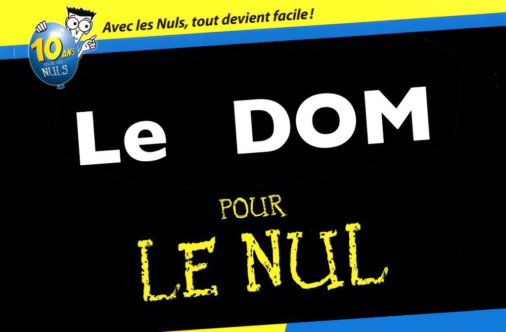
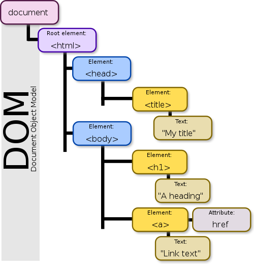

<!-- _paginate: skip -->
# Le DOM pour les ~~nuls~~ IDIA



<!-- _footer: <span class='red'>*</span> M. PERREIRA DA SILVA -->

---

<!-- _paginate: skip -->
# [Version PDF des slides](pdf/dom.pdf)

---

# DOM : les principes



- Document Object Model = représentation du document sous forme d'arbre
  - Documents HTML, XML, SVG, etc.
- [Document](https://developer.mozilla.org/fr/docs/Web/API/Document) : le document lui même
- [Document.documentElement](https://developer.mozilla.org/fr/docs/Web/API/Document/documentElement) : la racine du document (`<html>`)
- L'arbre est composé de (types de base) :
  * [Node](https://developer.mozilla.org/fr/docs/Web/API/Node) : l'élément de base 
    + [Element](https://developer.mozilla.org/fr/docs/Web/API/Element) : élément / "balise"
    + [Attribute](https://developer.mozilla.org/fr/docs/Web/API/Attr) : attribut d'un élément
  * [NodeList](https://developer.mozilla.org/fr/docs/Web/API/NodeList) : un tableau de Noeuds...
- Le texte contenu dans un élément est un simple noeud "texte"

---

# DOM : les principes

- Chaque type de document possède ses propres types spécifiques

  - Ex HTML: [HTMLElement](https://developer.mozilla.org/fr/docs/Web/API/HTMLElement), [HTMLImageElement](https://developer.mozilla.org/fr/docs/Web/API/HTMLImageElement), etc.

  - Ex SVG :  [SVGElement](https://developer.mozilla.org/fr/docs/Web/API/SVGElement), [SVGCircleElement](https://developer.mozilla.org/en-US/docs/Web/API/SVGCircleElement), etc.

- Pour les documents XML on utilise les types de base

- Le DOM permet de parcourir, consulter, modifier un document

---

# DOM : quelques outils

- Récupération d'un élément ([document.querySelector()](https://developer.mozilla.org/fr/docs/Web/API/Document/querySelector)) ou plusieurs ([document.querySelectorAll()](https://developer.mozilla.org/fr/docs/Web/API/Document/querySelectorAll)) à partir d'un [sélecteur CSS](https://developer.mozilla.org/fr/docs/Web/CSS/Sélecteurs_CSS)

  ```javascript
  const conteneur = document.querySelector('#conteneur');
  const sects = document.querySelectorAll('section');
  ```

---

# DOM : quelques outils

- Création d'éléments avec [document.createElement(*nomDeTag*)](https://developer.mozilla.org/fr/docs/Web/API/Document/createElement) ou modification de leur contenu texte ([textContent](https://developer.mozilla.org/fr/docs/Web/API/Node/textContent)) ou HTML ([innerHTML](https://developer.mozilla.org/fr/docs/Web/API/Element/innertHTML))

  ```javascript
  const para = document.createElement('p');

  para.textContent = 'Un petit texte sympa.';
  // ou
  para.innerHTLM = '<a href="#">Un lien</a>';
  ```

---

# DOM : quelques outils

- Manipulation des attributs avec [getAttribute()](https://developer.mozilla.org/fr/docs/Web/API/Element/getAttribute) ou [setAttribute(*attribut*, *valeur*)](https://developer.mozilla.org/fr/docs/Web/API/Element/setAttribute)

- Si on ne peut pas utiliser de classes ou d'id on utilise [style](https://developer.mozilla.org/fr/docs/Web/API/HTMLElement/style)
  
  ```javascript
  para.setAttribute('class', 'highlight');
  para.style.color = 'red';
  const attr = para.getAttribute('class');
  ```

---

# DOM : quelques outils

- Ajout d'un élément comme fils d'un autre avec [appendChild(*élément*)](https://developer.mozilla.org/fr/docs/Web/API/Node/appendChild)

- Suppression d'un fils avec [removeChild(*élément*)](https://developer.mozilla.org/fr/docs/Web/API/Node/removeChild)

- Suppression directe d'un élément avec [remove()](https://developer.mozilla.org/fr/docs/Web/API/ChildNode/remove)

  ```javascript
  conteneur.appendChild(para);
  conteneur.removeChild(para);
  // ou
  para.remove();
  ```

- [Document](https://developer.mozilla.org/fr/docs/Web/API/Document), [Node](https://developer.mozilla.org/fr/docs/Web/API/Node), [Element](https://developer.mozilla.org/fr/docs/Web/API/Element), [HTMLElement](https://developer.mozilla.org/fr/docs/Web/API/HTMLElement)  possèdent de nombreuses autres méthodes et propriétés

- Chaque [élément HTML](https://developer.mozilla.org/fr/docs/Web/API/Document_Object_Model#interfaces_des_éléments_html) possède ses propre spécificités

---

# Evenements : principes

- [addEventListener(*typeEvenement*, *callback*)](https://developer.mozilla.org/fr/docs/Web/API/EventTarget/addEventListener) : Enregistre une fonction (callback) qui sera appelée lors de l'évenement

  * Préciser le [type d'évenement](https://developer.mozilla.org/fr/docs/Web/Events) en 1er paramètre

  ```javascript
  // on récupère un bouton via le DOM
  let btn=document.querySelector('#my-button');

  // Ajout d'un écouteur d'évenement au 'click'
  btn.addEventListener('click', () => { // callback sous forme de fonction flèche

      // Petite boite de message pour l'utilisateur
        alert('You clicked me!');

      // Puis ajout d'un paragraphe à la fin du body
        let pElem = document.createElement('p');
        pElem.textContent = 'This is a newly-added paragraph.';
        document.body.appendChild(pElem);
  });
  ```

---

# Evenements : propagation

- Notion d'[event bubbling](https://developer.mozilla.org/fr/docs/Apprendre/JavaScript/Building_blocks/Evènements#le_bouillonnement_et_la_capture):
  * L'élément HTML qui gère un évenement n'est pas forcement celui qui l'a généré
  * Appel des gestionnaires d'évenement en cascade (enfant vers parents)
  * [Event.target](https://developer.mozilla.org/fr/docs/Web/API/Event/target) = l'élément à l'origine de l'évemenent
  * [Event.currentTarget](https://developer.mozilla.org/fr/docs/Web/API/Event/currentTarget) = l'élément dont le gestionnaire d'évenement a été appelé
  * [Event.stopPropagation()](https://developer.mozilla.org/fr/docs/Web/API/Event/stopPropagation) stoppe la propagation d'un évenement
- Exemple:

<div class='pure-g'>
<div class='pure-u-2-3'>

```Javascript
let form = document.querySelector('#ex-bubble form');

form.addEventListener('click', (event) => {
  event.target.style.backgroundColor = 'yellow';
  alert("target = " + event.target.tagName 
          + ", currentTarget=" 
          + event.currentTarget.tagName);
  event.target.style.backgroundColor = ''
});
```

</div>
<div class='pure-u-1-3'>

<div id="ex-bubble">
<form id="form">FORM
    <div>DIV
      <p>P</p>
    </div>
</form>
</div>

<style>
#ex-bubble form {
  background-color: green;
  position: relative;
  width: 150px;
  height: 150px;
  text-align: center;
  cursor: pointer;
}

#ex-bubble div {
  background-color: blue;
  position: absolute;
  top: 25px;
  left: 25px;
  width: 100px;
  height: 100px;
}

#ex-bubble p {
  background-color: red;
  position: absolute;
  top: 25px;
  left: 25px;
  width: 50px;
  height: 50px;
  line-height: 50px;
  margin: 0;
}

#ex-bubble {
  margin-top: 2em;
  line-height: 25px;
  font-size: 16px;
  position: absolute;
  right: 5em;
}
</style>

</div>
</div>