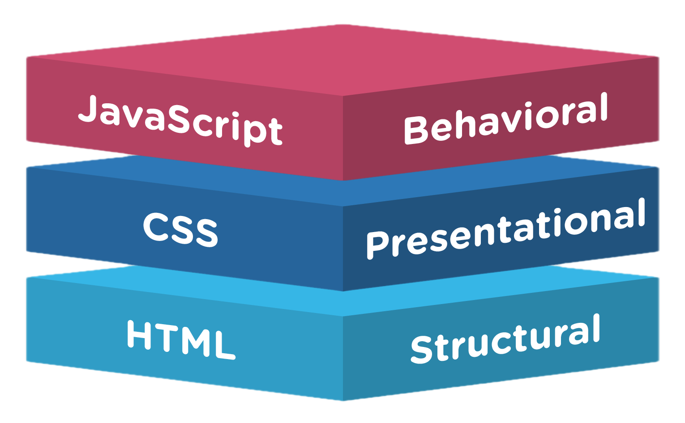
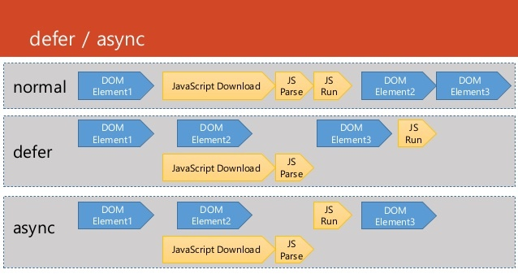

<!-- _paginate: skip -->
# HTML + CSS + JavaScript

## Amélioration de l'expérience utilisateur par couches...



<!-- _footer: <span class='red'>*</span> M. PERREIRA DA SILVA -->

---

<!-- _paginate: skip -->
# [Version PDF des slides](pdf/html.pdf)

---

# Les langages de description

- Définissent une **structure** et/ou des **règles**
- Sans langage spécifique, la structure n'est pas toujours explicite

**Exemple de texte seul:**

<div class='resultat'>
Polytech Nantes

L'école d'ingénieurs de l'Université de Nantes.

Polytech forme des étudiants ingénieurs, mais pas seulement. Elle délivre aussi des masters pour des publics nationaux et internationaux.

Le détail de ses formations est disponible sur son site web.

Ingénieur informatique: 3 ans d'études pour devenir un expert des technologies numériques.

Master culture numériques: un enseignement interdisciplinaire pour des publics variés.
</div>

---

# Les langages de description (HTML)

- **Structurer** l'information en vue de la **présenter**
  - **Balises**: définissent le sens
    - Exemple: `<h3>Polytech Nantes</h3>`
  - **Attributs**: permettent d'apporter des informations complémentaires
    - Exemple: `<a href="http://polytech.univ-nantes.fr">site web</a>`

```html
<section id="polytech_nantes">
<h3>Polytech Nantes</h3>
<h4>L'école d'ingénieurs de l'Université de Nantes.</h4>
<p>Polytech forme des étudiants ingénieurs, mais pas seulement. Elle délivre 
  aussi des masters pour des publics nationaux et internationaux.</p>
<p>Le détail de ses formations est disponible sur son 
  <a href="http://polytech.univ-nantes.fr">site web</a>.</p> 
<ul>
    <li><h5>Ingénieur informatique:</h5> 3 ans d'études pour devenir un expert 
    des technologies numériques.
</li>
    <li><h5>Master culture numériques:</h5>
    un enseignement interdisciplinaire pour des publics variés.</li>
</ul>
</section>
```

---

# Les langages de description (HTML)

**Rendu du document** HTML dans un navigateur web:
<div class='resultat'>

<section id="polytech_nantes_no_css">
<h3>Polytech Nantes</h3>
<h4>L'école d'ingénieurs de l'Université de Nantes.</h4>
<p>Polytech forme des étudiants ingénieurs, mais pas seulement. Elle délivre aussi des masters pour des publics nationaux et internationaux.</p>
<p>Le détail de ses formations est disponible sur son <a href="http://polytech.univ-nantes.fr">site web</a>.</p> 
<ul>
    <li><h5>Ingénieur informatique:</h5> 3 ans d'études pour devenir un expert des technologies numériques.
</li>
    <li><h5>Master culture numériques:</h5> un enseignement interdisciplinaire pour des publics variés.</li>
</ul>
</section>

</div>

---

# Les langages de description (CSS)

- Définir des **règles** de présentation
    - S'appliquent à un/des éléments choisis à l'aide d'un **sélecteur**

```CSS
#polytech_nantes h3, #polytech_nantes h4{
    text-align: center;
}

#polytech_nantes{      /* un sélecteur */ 
    font-size: 12pt;   /* une règle    */
}

#polytech_nantes li{
    width: 45%;
    display: inline-block;
    vertical-align: top;
    text-align: center;
}
```
---
# Les langages de description (CSS)

**Rendu du même document** HTML avec les règles CSS
<div class='resultat'>

<style scoped>
#polytech_nantes h3, #polytech_nantes h4{
    text-align: center;
}

#polytech_nantes{
    font-size: 12pt;
}

#polytech_nantes li{
    width: 45%;
    display: inline-block;
    vertical-align: top;
    text-align: center;
}
</style>
<section id="polytech_nantes">
<h3>Polytech Nantes</h3>
<h4>L'école d'ingénieurs de l'Université de Nantes.</h4>
<p>Polytech forme des étudiants ingénieurs, mais pas seulement. Elle délivre aussi des masters pour des publics nationaux et internationaux.</p>
<p>Le détail de ses formations est disponible sur son <a href="http://polytech.univ-nantes.fr">site web</a>.</p> 
<ul>
    <li><h5>Ingénieur informatique:</h5> 3 ans d'études pour devenir un expert des technologies numériques.
</li>
    <li><h5>Master culture numériques:</h5> un enseignement interdisciplinaire pour des publics variés.</li>
</ul>
</section>

</div>

---

# Les langages de description (XML/JSON)
- **Structurer** l'information en vue de la **manipuler**

  | Département | Nom              | Surface | Habitants |
  | :---------: | :--------------: | ------: | --------: |
  | 44          | Loire-atlantique | 6815    | 1328620   |
  | 85          | Vendée           | 6720    | 655506    |

devient

<div class='pure-g'>
<div class='pure-u-1-2'>

```xml
<liste_departements>
      <departement id="44">
            <nom> Loire-Atlantique </nom>      
            <surface> 6815 </surface>
            <habitants> 1328620 </habitants>
        </departement>
        <departement id="85">
            <nom> Vendée </nom>
            <surface> 6720 </surface>
            <habitants> 655506 </habitants>
      </departement>
</liste_departements>
```

<div class='center'>XML</div>
</div>
<div class='pure-u-1-2'>

```json
[{ "44": {
          "nom": "Loire-Altantique",           
          "surface": "6815",
          "habitants": "1328620"
    }
}, 
{ "85": {
          "nom": "Vendée",
          "surface": "6720",
          "habitants": "655506"
    }
}]
```

<div class='center'>JSON</div>
</div>

---

# (X)HTML(5) !


---

# Un peu d'histoire...

- 1990 : HTML 1
- 1995 : HTML 2
- 1995 : HTML+ et HTML 3 (non standards)
- 1997 : HTML 3.2 et HTML 4 (standards W3C)
- 1998 : XML 1.0
- 1999 : HTML 4.01 (standards W3C)
- 2000 : XHTML 1.0 (HTML 4 réécrit en XML)
- 2001: XHTML 1.1 (améliorations mineures de XHTML 1.0)
- 2003 : XHTML 2 (concurrent de HTML 5)
- 2008: HTML 5 (premier "Draft" public)
- 2014 : [HTML 5](http://www.w3.org/TR/html5/) (standardisé)

---

# Vocabulaire XML

- **Elément** : nom, notion abstraite
  - Exemple : `p`

- **Balise** : forme concrète d’un élément

  - Balise ouvrante : `<element>`
    - Exemple:   `<p>`

  - Balise fermante : `</element>`
    - Exemple:   `</p>`

---

# Vocabulaire XML

- **Attribut** : propriété d’un élément (nom, valeur)
  - `<element nom="valeur" >`

    - Exemple: `<p id="paraPrincipal" >`

- **Commentaire**: non interprétés par les outils XML
  - `<!-- Ceci est un commentaire ! -->`

- **DTD** et **Schema**: définissent le vocabulaire et la grammaire d'un document XML
  - Balises utilisables et leur relations hiérarchiques

---

# Spécificités HTML

- Très proche de XML mais...

- Commence par un doctype plutôt qu'un prologue

  - XML : `<?xml version="1.0"?>`

  - HTML5 : `<!DOCTYPE html>`

  - Mais un document XML peut aussi contenir un doctype !

- Balise auto-fermante `<element/>` ou vide `<element>`

  - Exemple:   `` (XHTML) ou `` (HTML5)

---

# Quelques bonnes habitudes

- Règles **XHTML** (à suivre aussi en HTML)
  - Les noms des balises doivent être toujours en minuscule
  - Toute balise ouverte doit être fermée
  - Les chevauchements entre balise sont interdits
  - Les noms des attributs doivent être écrits en minuscule
  - Les valeurs des attributs doivent être entre guillemets doubles `"..."`

---

# Quelques bonnes habitudes

- Respecter la sémantique des balises
  - Ex : les tableaux ne servent pas à la mise en page !

- Ne pas abuser des balises génériques (`<span>` et `<div>`)

- Séparer le fond (HTML) de la forme (CSS)
  - Pas de styles en *ligne* dans le code HTML

  ```html
  <!-- A éviter ! -->
  <span style="color:red;">Du texte en rouge...</span>
  ```

- Toujours valider son code HTML (validateur W3C)

- Penser à l'accessibilité (cf. plus loin)

---

# Les différentes version de HTML et leur DOCTYPE

- Un document (X)HTML **doit** commencer par une balise DOCTYPE
  
  - Il y a de (trop) nombreuses variantes

- Les principales
  ```html
  <!-- HTML 5 : la simplicité !-->
  <!DOCTYPE html>

  <!-- HTML 4.01 STRICT (existe aussi en TRANSITIONAL et FRAMESET)-->
  <!DOCTYPE HTML PUBLIC "-//W3C//DTD HTML 4.01//EN" "http://www.w3.org/TR/html4/strict.dtd">

  <!-- XHTML 1.1 (STRICT par défaut)-->
  <!DOCTYPE HTML PUBLIC "-//W3C//DTD XHTML 1.1//EN" "http://www.w3.org/TR/xhtml11/DTD/xhtml11.dtd">
  ```

---

# Pourquoi HTML 5 ?

- C'est le dernier standard en date...

- HTML 4 en **plus simpe** !

- Meilleure **sémantique** : nouvelles balises `header`, `footer`, `nav` , etc.

- Meilleur **référencement** : microdonnées = nouveaux attributs `itemscope`,`itemtype`, etc.

- Scripting plus simple : **JavaScript** est le langage **par défaut**

- Des formulaires **plus complets** : types `datetime`, `number`, `search`, etc.

- **Audio et vidéo** supportés nativement (plus besoin de plugin)

---

# HTML 5 et JavaScript

- Une **API** importante fait partie de HTML 5

  - DOM amélioré
  - Stockage local (permanent ou temporaire)
  - Mode hors ligne
  - Communications bi-directionnelles avec un serveur (WebSockets)
  - Dessin 2D (Canvas)
  - Géolocalisation
  - Accès à l'historique Web
  - Le drag and drop
  - "Multithreading" (WebWorkers)
  - Communication entre pages (Messaging)
  - Etc.

---

# Un document HTML5 minimal

```html
<!-- déclaration du doctype HTML5 -->
<!DOCTYPE html>
<!-- il faut préciser la langue du document html -->     
<html lang="fr">  
  <!-- entête: titre, feuilles de style, scripts, etc. -->  
  <head>
    <!-- encodage des caractères : obligatoire ! -->            
    <meta charset="utf-8">
    <!-- titre de la page: obligatoire -->  
    <title>title</title>
    <!-- feuille de style: optionnel -->    
    <link rel="stylesheet" href="style.css">
    <!-- script: optionnel -->  
    <script src="script.js"></script>         
  </head>
  <!-- contenu de la page -->
  <body>
    <!-- ici -->
  </body>
</html>
```

---

# Structure d'un document HTML5

## DOCTYPE

- Déjà vu précédemment...

  - Définit le **type de document** HTML

  - Précise la DTD à utiliser

  - Important pour que le navigateur interprète correctement la page

---

# Structure d'un document HTML5

## La balise `<html></html>`

- Indique au navigateur qu’il s’agit d’un **document html**

- C'est la **racine** du document html

  - Contient toutes les autres balises

---

# Structure d'un document HTML5)

## La balise `<head></head>`

- Contient des **(méta) informations** concernant le document
- Balises filles acceptées:
  + `title`: titre du document (**Obligatoire**)
  + `style`: définition de styles intégrée au document
  + `base`: URL de base pour tous le liens relatifs
  + `link`: liens vers des feuilles de style
  + `meta`: méta-données (mots clés, auteur, etc.)
  + `script`: scripts (par défaut JavaScript)
		- Attributs `async` et `defer` pour un chargement asynchrone
    	- Attribut `type="module"` pour charger un [module javascript](https://developer.mozilla.org/fr/docs/Web/JavaScript/Guide/Modules)
    	- On peut aussi charger les scripts en fin de `<body>` (obsolète)
  + `noscript`: contenu à insérer si pas de support des scripts

---

# Petite parenthèse...

## Chargement des scripts



**Note :** pas besoin d'utiliser `defer` lors du chargement d'un **module javascript**, c'est fait automatiquement.

---

# Structure d'un document HTML5

## La balise `<body></body>`

- Le contenu de la page web

- Toutes les balises affichées par le navigateur sont des balises filles de `body`

---

# Les balises d'HTML5

## <span class='red'>ATTENTION : Liste et description non exhaustive</span>

Ce cours n'a pas vocation à être une référence. D'autres sources d'information sont largement disponibles sur le web.

- [https://developer.mozilla.org/fr/docs/Web/HTML/Reference](https://developer.mozilla.org/fr/docs/Web/HTML/Reference)

- [https://devdocs.io/html](https://devdocs.io/html) (agrégateur de documentations)

- Et bien sûr les textes des [standards du W3C](https://www.w3.org/TR/) !

---

# Les deux grands types de balises

<div class='pure-g'>
<div class='pure-u-1-2'>

### <span class='red'>Bloc</span>

- Contient
  + Du texte
  + Des éléments "En ligne"
  + **Des éléments "Bloc"**
  + Des éléments auto-fermants
- Position
  + **Les uns sous les autres**
- Largeur
  + **Celle du conteneur**
- Exemple: `<div>`, `<p>`, `<h1>`

</div>
<div class='pure-u-1-2'>

### <span class='blue'>En ligne</span>

- Contient
  + Du texte
  + Des éléments "En ligne"
  + **Des éléments "En ligne" !**
  + Des éléments auto-fermants
- Position
  + **Les uns à coté des autres**
- Largeur
  + **Sans dimension**
- Exemple: `<span>`, `<a>`, ``

</div>
</div>

<!-- _footer: <span class='red'>*</span> Il y en a d'autres (list-item, table, table-cell, etc.) -->

---

# Les deux grands types de balises (exemple)

<div class='pure-g'>
<div class='pure-u-1-2'>

### <span class='red'>Bloc</span>

```html
<div style="background:yellow;">
    Une boite jaune
</div>

<div style="background:green;">
    Une boite verte
</div>
```

Résultat:

<div class='resultat'>

<div style="background:yellow;">Une boite jaune</div>
<div style="background:green;">Une boite verte</div>
</div>

</div>
<div class='pure-u-1-2'>

### <span class='blue'>En ligne</span>

```html
<span style="background:yellow;">
    Une boite jaune
</span>

<span style="background:green;">
    Une boite verte
</span>
```

Résultat:

<div class='resultat'><div></div>

<span style="background:yellow;">Une boite jaune</span>
<span style="background:green;">Une boite verte</span>


</div>
</div>

---

# Balises génériques

- `<div>` : balise **<span class='red'>bloc</span>**
  
  + Permet de regrouper des éléments
  + Aide à l'agencement du contenu
  + Ne pas en abuser !!!

- `<span>` : balise **<span class='blue'>en ligne</span>**
  
  + Permet d'associer un style à une partie de texte

- Ne sont utiles qu'en association avec les **attributs**
  
  + `class`: permet d'associer un même style CSS à différentes balises
  + `id`: identifie de manière unique une balise
  + `style`: permet d'ajouter du code CSS dans une balise HTML **(à éviter)**

---

# Balises génériques

- Exemple:

<div class='pure-g'>
<div class='pure-u-1-2'>

HTML

```html
<div id="div1" class="uneDiv">
    La div 1
</div>

<div id="div2" class="uneDiv">
    La div 2
</div>
```

</div>
<div class='pure-u-1-2'>

CSS

```css
.uneDiv {   display: inline;
            border-style: solid;
            border-color: black; }
#div1 { background-color: green;
        margin: 5px;}
#div2 { background-color: yellow;
        padding: 5px;}}
```

</div>
</div>

<div class='pure-g'>
<div class='pure-u-1-2'>

Résultat sans CSS: 

<div class='resultat'>

<div>La div 1</div>
<div>La div 2</div>

</div>
</div>
<div class='pure-u-1-2'>

<p>Résultat avec CSS: 

<div class='resultat'>

<div id="div1" class="uneDiv">La div 1</div><div id="div2" class="uneDiv">La div 2</div><style>.uneDiv {
    display:inline;
    border-style: solid;
    border-color: black;
} #div1 { background-color: green; margin: 5px;} #div2 { background-color: yellow; padding: 5px;}}</style></p>

</div>
</div>
</div>

---

# Les attributs globaux

Peuvent être définis sur n'importe que élément HTML

- `accesskey`: raccourci clavier de l'élément

- **`class`**: permet d'associer un même style CSS à différentes balises
  + classes multiples possibles. Ex: `<div class="classe1 classe2"></div>`

- `contenteditable`: rend l'élément modifiable

- `contextmenu`: permet de référencer un élément `<menu>` (contenant des `<menuitem>`) qui apparaitra au clic droit sur l'élément

- `data-*`: permet d'intégrer des données au code HTML, qui pourront être accédées via le DOM

- `dir`: direction du texte de l'élément

---

# Les attributs globaux

Peuvent être définis sur n'importe que élément HTML

- `hidden`: permet de "cacher" un élément **(pas que graphiquement)**

- **`id`**: identifiant de l'élément

- `lang`: définit le langage de l'élément

- `style`: permet d'ajouter du code CSS dans une balise HTML **(à éviter)**

- `tabindex`: spécifie l'ordre de navigation de l'élément via la touche "tab"

- `title`: informations complémentaires concernant l'élément, apparaissant le plus souvent sous forme de bulle d'aide

- `translate`: indique si l'élément doit être traduit en cas de traduction de la page

---

# Sections du document

- `<header>`: Section d'**introduction** d'un article, d'une autre section ou du document entier

- `<nav>`: Liens de **navigation** principaux (au sein du document ou vers d'autres pages)

- `<main>`: Le contenu **principal** de la page

- `<footer>`: Section de **conclusion** d'une section ou d'un article, voire du document entier

- `<section>`: Section générique regroupant un **même sujet**, une **même fonctionnalité**, possède un entête ou un titre

- `<article>`: Section de contenu **indépendante**, pouvant être extraite individuellement du document ou syndiquée (flux RSS ou équivalent), sans pénaliser sa compréhension

- `<aside>`: Section dont le contenu est un **complément** par rapport à ce qui l'entoure

<!-- _footer: <span class='red'>*</span> Ce sont toutes des balises de type bloc -->

---

# Exemple de sections d'un document


<!-- _footer: <span class='red'>*</span> d'autres solutions sont possibles... -->

---

# Bien utiliser les éléments de section


---

# Les balise de structuration

- `<abbr>`: <abbr>Abréviation</abbr>
- **<span class='red'>`<blockquote>`</span>**: <blockquote>Citation (longue)</blockquote>
- `<cite>`: <cite>Citation du titre d'une œuvre ou d'un évènement</cite>
- `<q>`: <q>Citation (courte)</q>
- `<sup>`: Texte<sup>Exposant</sup>
- `<sub>`: Texte<sub>Indice</sub>
- `<strong>`: <strong>Mise en valeur forte</strong>
- `<em>`: <em>Mise en valeur normale</em>
- `<mark>`: <mark>Mise en valeur visuelle</mark>

<!-- _footer: <span class='red'>*</span>En **<span class='red'>rouge, gras</span>**: les balises de type bloc -->

---

# Les balise de structuration

<div class='pure-g'>
<div class='pure-u-1-2'>

- **<span class='red'>`<h1>`</span>**: <h1>Titre de niveau 1</h1>
- **<span class='red'>`<h2>`</span>**: <h2>Titre de niveau 2</h2>
- **<span class='red'>`<h3>`</span>**: <h3>Titre de niveau 3</h3>

</div>
<div class='pure-u-1-2'>

- **<span class='red'>`<h4>`</span>**: <h4>Titre de niveau 4</h4>
- **<span class='red'>`<h5>`</span>**: <h5>Titre de niveau 5</h5>
- **<span class='red'>`<h6>`</span>**: <h6>Titre de niveau 6</h6>

</div>
</div>

---

# Les balise de structuration

- **<span class='red'>`<figure>`</span>**: <figure>Figure (image, code, etc.)</figure>
- **<span class='orange'>`<figcaption>`</span>**: <figcaption>Description de la figure</figcaption>
- `<a>`: <a>Lien hypertexte</a>. L'attribut `href` définit l'URL cible
- `<br>` : (**ne devrait pas servir souvent !**) <br>Retour à la ligne
- **<span class='red'>`<p>`</span>**: <p>Paragraphe</p>
- `<hr`>: Ligne de séparation horizontale<hr>

---

# Les balise de structuration

- **<span class='red'>`<address>`</span>**: <address>Adresse de contact</address>
- `<del>`: <del>Texte supprimé</del>
- `<ins>`: <ins>Texte inséré</ins>
- `<dfn>`: <dfn>Définition</dfn>
- `<kbd>`: <kbd>Saisie clavier</kbd>
- **<span class='red'>`<pre>`</span>**: <pre>Affichage formaté (pour les codes sources)</pre>
- `<progress>`: Barre de progression <progress>
- `<time>`: Date ou heure.  Ex: <time datetime="2015-03">Mars 2015</time>

---

# Les listes

<div class='pure-g'>
<div class='pure-u-1-2'>

- **<span class='red'>Liste ordonnée `<ol>`</span>**:

```html
<ol>
   <li>Premier élément</li>
   <li>Second élément</li>
</ol>
```

Résultat:

<div class='resultat'>

<ol>
  <li>Premier élément</li>
  <li>Second élément</li>
</ol>

</div>
</div>
<div class='pure-u-1-2'>

- **<span class='red'>Liste non ordonnée `<ul>`</span>**:

```html
<ul>
   <li>Un élément</li>
   <li>Un autre élément</li>
</ul>
```

Résultat:

<div class='resultat'>
<ul>
  <li>Un élément</li>
  <li>Un autre élément</li>
</ul>

</div>
</div>
</div>

Dans tous les cas les listes contiennent des <span class='orange'><strong>éléments `<li>`</strong></span> et peuvent être imbriquées les unes dans les autres.

---

# Les listes de définitions (plus rares)

- Trois types de balises nécessaires

- **<span class='red'>`<dl>`</span>**: la liste de définitions
  - **<span class='orange'>`<dt>`</span>**: un terme à définir
  - **<span class='orange'>`<dd>`</span>**: la définition du terme

<div class='pure-g'>
<div class='pure-u-1-2'>

Exemple:

```html
<dl>
  <dt>HTML</dt><dd>Langage 
    de représentation de pages web</dd>
  <dt>CSS</dt><dd>Langage 
    de mise en forme de pages web</dd>
</dl>
```
</div>
<div class='pure-u-1-2'>

Résultat:

<div class='resultat'>
<dl>
  <dt>HTML</dt><dd>Langage de représentation de pages web</dd>
  <dt>CSS</dt><dd>Langage de mise en forme de pages web</dd>
</dl>

</div>
</div>

---

# Les tableaux

- **<span class='red'>`<table>`</span>**: Balise **'racine'** du tableau. Contient tous les autres éléments

- **<span class='orange'>`<caption>`</span>**: **Titre** du tableau *(Optionnel)*

- **<span class='red'>`<thead>`</span>**: **En-tête** du tableau *(Optionnel)*

- **<span class='red'>`<tbody>`</span>**: **Corps** du tableau *(Optionnel)*

- **<span class='red'>`<tfoot>`</span>**: **Pied** du tableau *(Optionnel)*

- .**<span class='orange'>`<tr>`</span>**: Une **ligne** du tableau

- **<span class='orange'>`<td>`</span>**: Une **colonne** du tableau

- Les attributs `colspan` et `rowspan` servent à **fusionner** des cellules

---

# Les tableaux (exemple)

<div class='pure-g'>
<div class='pure-u-1-2'>

```html
<table>
   <caption>Liste d'étudiants</caption>
   <!-- En-tête (optionnel) -->
   <thead>
       <tr>
           <th>Nom</th>
           <th>Numéro</th>
       </tr>
   </thead>
   <!-- Corps du tableau -->
   <tbody>
       <tr>
           <td>James</td>
           <td>007</td>
       </tr>
       <tr>
           <td>Ulla</td>
           <td>3615</td>
       </tr>
    </tbody>
</table>
```

</div>
<div class='pure-u-1-2'>

Résultat:

<div class='resultat'>

<table>
   <caption>Liste d'étudiants</caption>
   <thead>
       <tr>
           <th>Nom</th>
           <th>Numéro</th>
       </tr>
   </thead>
   <tbody>
       <tr>
           <td>James</td>
           <td>007</td>
       </tr>
       <tr>
           <td>Ulla</td>
           <td>3615</td>
       </tr>
    </tbody>
</table>


</div>
</div>
</div>

---

# Les images

- `` : Une **image** dont le fichier source est indiqué par l'attribut `src`.

  + L'attribut `alt` fournit une description textuelle de l'image (accessibilité).

  + L'attribut `srcset` permet de définit différentes tailles d'image (responsive + high dpi)

  + Peut être insérée dans une balise `<a>` pour créer une image cliquable

- `<picture>` et `<source>`: Solution HTML5, alternative à `srcset`, pour spécifier **différentes tailles d'images** (responsive + high dpi) ou **différents formats** (ex: JPG et WebP)

- `<canvas>`: **Surface** (matricielle) de dessin, qui sera manipulée via l'API javascript éponyme.

  + A besoin d'un attribut `id` pour être référencée en JavaScript

  + Ne pas oublier de lui donner une largeur et une hauteur (de préférence en CSS)

---

# Les images (exemples)

- `` et `srcset`

  ```html
  
  ```

- `<picture>` et `<source>`

  ```html
  <picture>
    <source media="(min-width: 650px)" srcset="images/kitten-large.png">
    <source media="(min-width: 465px)" srcset="images/kitten-medium.png">
    <!-- un élément , pour les navigateurs ne supportant pas <picture> -->
    
  </picture>
  ```

- `<canvas>`

  ```html
  <canvas id="drawing_area" width="800" height="600"></canvas>
  ```

---

# Les balises Audio

- **<span class='red'>Nouveau depuis HTML5</span>** : avant, aucun moyen standard de jouer du son
- `<audio>` : Définit un **son** à jouer sur une page
- Attributs utiles:
  + `src`: L'URL du son à jouer
		* **Attention** : tous les navigateurs ne supportent pas les mêmes codecs. Il faut au moins fournir le son au formats Ogg/Vorbis et MP4/AAC
  + `autoplay`: Comme son nom l'indique...
  + `controls`: Permet d'afficher une interface de lecture du son
  + `type`: Le type MIME du son à jouer

Exemple:

```html
<audio controls src="http://freedownloads.last.fm/download/604040204/Goliath.mp3" 
type="audio/mp3">
  Description alternative ici !
</audio>
```

---

# Les balises Vidéo

- **<span class='red'>Nouveau depuis HTML5</span>** : avant, aucun moyen standard de jouer des vidéos
- `<video>` : Définit une **vidéo** à jouer sur une page
  Attributs utiles:
  + `src`: L'URL du son à jouer
		- **Attention** : comme pour l'audio, tous les navigateurs ne supportent pas les mêmes codecs. Le .h264 (mp4) est [de mieux en mieux supporté](http://caniuse.com/#feat=mpeg4), mais il faut aussi compter avec WebM et Theora.
  + `autoplay`: Comme son nom l'indique...
  + `controls`: Permet d'afficher une interface de lecture du son
  + `type`: Le type MIME du son à jouer

Exemple:

```html
<video controls="controls">
  <source src="video.mp4" type="video/mp4" >
  <source src="video.webm" type="video/webm" >
  <source src="video.ogv" type="video/ogg" >
  Description alternative ici !
</video>
```

---

# Les iFrame

- `<iframe>`: Permet d'inclure une page web à l'intérieur d'une autre (ex: une carte Google Map).

- Attributs utiles:
  + `src`: URL du contenu web à intégrer
  + `srcdoc`: Code HTML à intégrer (alternative à `src`)
  + `sandbox` .blue[(HTML5)]: Permet de spécifier certaines options de sécurité
  + `allowfullscreen`: Permet au contenu de l'iFrame de remplir tout l'écran

Exemple basique:

```html
<iframe id="theFrame" src="http://example.com/"></iframe>
```

Exemple de vidéo YouTube:

```html
<iframe width="560" height="315" src="https://www.youtube.com/embed/kPHLewY6Oc0" 
frameborder="0" allowfullscreen></iframe>
```

---

# Autre contenu

- `<embed>` (HTML5) : La bonne manière d'intéger du contenu externe via un plugin (Ex: Flash)
  
  + Attributs utiles:
		- `src`: URL du contenu externe à intégrer
    	- `type`: Type MIME du contenu externe

  + Pas de possibilité de paramétrage supplémentaire

- `<object>` : Element plus générique, représentant du contenu externe
  
  + Attributs utiles:
    	- `data`: URL du contenu externe à intégrer
    	- `type`: Type MIME du contenu externe

  + On peut passer des paramètres supplémentaire a l'objet externe via via l'inclusion de balises `<param>` et ses attributs `name` et `value`

---

# Autre contenu (exemples)

- `<embed>` (HTML5)

  ```html
  <!-- Une vidéo lue avec le plugin Quicktime -->
  <embed type="video/quicktime" src="movie.mov" width="640" height="480">

  <!-- Un contenu (ex: animation) Flash -->
  <embed type="application/x-shockwave-flash" src="anim.swf"  width="640" height="480">
  ```

- `<object>`

  ```html
  <!-- Un contenu (ex: animation) Flash -->
  <object data="anim.swf" type="application/x-shockwave-flash"></object>

  <!-- Un contenu (ex: animation) Flash avec paramètres-->
  <object data="anim.swf" type="application/x-shockwave-flash">
    <param name="foo" value="bar">
  </object>
  ```

---

# Les formulaires

- C'est en grande partie grace à eux que l'on peut **interagir avec l'utilisateur** et **communiquer avec le serveur web** (hors AJAX)

- La balise `<form>` permet de **déclarer un formulaire**

- Attributs utiles
	+ `action`: URL de la page / script serveur qui traitera les données du formulaire
	+ `method`: Méthode HTTP à utiliser (**GET** ou POST)
	+ `enctype`: Seulement utilisé si `method=post`
  		- **`application/x-www-form-urlencoded`**: encodage des données en *percent encoding*, comme les URI
  		- `multipart/form-data`: Pas d'altération des données. Nécessaire en cas d'envoi de fichier (`<input type="file">`)
  		- `text/plain`: Seuls les espaces sont convertis en '+'

---

# Regroupements et labels

- `<fieldset>`: Permet de créer des **groupes de widgets** `<input>`
  + Est particulièrement important pour les boutons 'radio'

- `<legend>`: **Légende** du groupe créé avec un `<fieldset>`

- `<label`: Permet d'associer une **étiquette texte** à un champ `<input>`
  + L'attribut `for` indique l'`id` du champ à étiqueter
  + Important pour que votre formulaire soit compatible avec les outils d'**accessibilité**

- `<output>`: Permet de créer un champ qui recevra le **résultat d'un calcul** issu de plusieurs autres champs
  + L'attribut `for` spécifie une liste d'`id` de champs, séparés par des espaces

---

# Exemple de regroupement

<div class='pure-g'>
<div class='pure-u-2-3'>

```html
<form>
  <fieldset>
    <legend>Taille de boisson</legend>
    <p>
      <input type="radio" name="size" id="taille_1" 
        value="petit" >
      <label for="taille_1">Petit</label>
    </p>
    <p>
      <input type="radio" name="size" id="taille_2" 
        value="moyen" >
      <label for="taille_2">Moyen</label>
    </p>
    <p>
      <input type="radio" name="size" id="taille_3" 
        value="grand" >>
      <label for="taille_3">Grand</label>
    </p>
  </fieldset>
</form>
```

</div>
<div class='pure-u-1-3'>

Résultat:

<div class='resultat'>

<form>
  <fieldset>
    <legend>Taille de boisson</legend>
    <p>
      <input type="radio" name="size" id="taille_1" value="petit" >
      <label for="taille_1">Petit</label>
    </p>
    <p>
      <input type="radio" name="size" id="taille_2" value="moyen" >
      <label for="taille_2">Moyen</label>
    </p>
    <p>
      <input type="radio" name="size" id="taille_3" value="grand" >
      <label for="taille_3">Grand</label>
    </p>
  </fieldset>
</form>

</div>
</div>
</div>

---

# Exemple labels

```html
<form>
  <p>
    <input type="checkbox" id="j_aime_1" name="aime_pommes" value="1">
    <label for="j_aime_1">J'aime les pommes</label>
  </p>
  <p>
    <label for="j_aime_2">J'adore les sushis</label>
    <input type="checkbox" id="j_aime_2" name="aime_sushis" value="1">
  </p>
</form>
```

Résultat:

<div class='resultat'>

<form>
  <p>
    <input type="checkbox" id="j_aime_1" name="aime_pommes" value="1">
    <label for="j_aime_1">J'aime les pommes</label>
  </p>
  <p>
       <input type="checkbox" id="j_aime_2" name="aime_sushis" value="1">
    <label for="j_aime_2">
      J'adore les sushis
    </label>
  </p>
</form>

</div>

---

# Exemple de champ `<output>`

```html
<!-- notre machine à multiplier -->
<form oninput="output.value = (val1.valueAsNumber || 0) * (val2.valueAsNumber || 0)" id=foo>
  <input type=number name=val1> X
  <input type=number name=val2> =
  <output name=output for="val1 val2" form=foo>0</output>
</form>
```

Résultat:

<div class='resultat'>

<form oninput="output.value = (val1.valueAsNumber || 0) * (val2.valueAsNumber || 0)" id=foo>
  <input type=number name=val1> X
  <input type=number name=val2> =
  <output name=output for="val1 val2" form=foo>0</output>
</form>

</div>

---

# Les widgets

- L'élément `<input>` permet de définir de **nombreux types de widget**
  + Il est généralement déclaré à l'intérieur d'un paragraphe `<p>`

- L'attribut `type` spécifie le **type du widget**
  + Champs textes mono-ligne: `text`, `email`, `password`, `search`, `tel`, `url`
  + Champs non textuels: `checkbox`, `color`, `file`, `hidden`, `number`, `radio`, `range`
  + Date et heure: `date`, `datetime`, `datetime-local`, `month`, `time`, `week`
  + Boutons: `button`, `image`, `reset`, `submit`

- Nombreux autres attributs spécifiques à chaque type d'input (ex: `min`, `max`, `list`, etc.) nécessaires pour l'**auto-validation** des formulaires

---

# Les boutons

- L'élément `<button>` est très proche d'un champ `<input>`  de type bouton

- Contrairement à `<input>`, il peut **contenir du texte formaté ou des images**

- Trois types de boutons (attribut `type`)

  + `submit`: Envoie les données du formulaire au serveur

  + `reset`: Réinitialiser tous les widgets du formulaire à leur valeur par défaut

  + `anonymous`: Pas de comportement pré-défini. Doit être exploité à l'aide de code JavaScript

---

# Les widgets (exemple)

```html
<form>
  <p>
    <label for="t1">Texte:</label>
    <input id="t1" type="text" required pattern="^test1|test2$">
  </p>
  <!-- Champ email pouvant contenir plusieurs adresse -->
  <p>
    <label for="e1">Email:</label>
    <input id="e1" type="email" required multiple>
  </p>
  <!-- Champ mot de passe (n'affiche pas le mot de passe) -->
  <p>
    <label for="p1">Mot de passe:</label>
    <input id="p1" required type="password">
  </p>
  <!-- Champ de recherche avec historique (même site) et placeholder -->
  <p>
    <label for="s1">Recherche:</label>
    <input id="s1" type="search" placeholder="Faites une recherche !">
  </p>
  <!-- le bouton de validation -->
  <button type="submit">Tester la <strong>validation</strong></button>
</form>
```

---

# Les widgets (exemple)

Resultat:

<div class='resultat'>

<form>
  <p>
    <label for="t1">Texte:</label>
    <input id="t1" type="text" required pattern="^test1|test2$">
  </p>
  <p>
    <label for="e1">Email:</label>
    <input id="e1" type="email" required multiple>
  </p>
  <p>
    <label for="p1">Mot de passe:</label>
    <input id="p1" required type="password">
  </p>
  <p>
    <label for="p1">Recherche:</label>
    <input id="s1" type="search" placeholder="Faites une recherche !" autosave>
  </p>
  <button type="submit">Tester la <strong>validation</strong></button>
</form>

</div>

---

# Zones de texte multi-lignes

- L'élément `<textarea>` peut contenir plusieurs lignes de texte
- On définit son nombre de lignes et colonnes avec les attributs `rows` et `cols`

Exemple:

```html
<textarea cols="20" rows="3">Du texte à l'intérieur</textarea>
```

Resultat:

<div class='resultat'>
<textarea cols="20" rows="3">Du texte à l'intérieur</textarea>

</div>

---

# Listes déroulantes

- L'élément `<select>` définit une liste déroulante
  + `<option>`: permet de spécifier les valeurs possibles
  		* L'attribut `selected` de  `<option>` indique la valeur par défaut de la liste
  + `<optgroup>`: Permet de regrouper ces valeurs
  + L'attribut `multiple` de `<select>` permet de sélectionner plusieurs options

<div class='pure-g'>
<div class='pure-u-1-2'>

Exemple:

```html
<select>
  <optgroup label="Fruits">
    <option>Banane</option>
    <option selected>Pomme</option>
    <option>Orange</option>
  </optgroup>
  <optgroup label="Légumes">
    <option>Carotte</option>
    <option>Pomme de terre</option>
    <option>Choux</option>
  </optgroup>
</select>
```

</div>
<div class='pure-u-1-2'>

Résultat:

<div class='resultat'>

<select>
  <optgroup label="Fruits">
    <option>Banane</option>
    <option selected>Pomme</option>
    <option>Orange</option>
  </optgroup>
  <optgroup label="Légumes">
    <option>Carotte</option>
    <option>Pomme de terre</option>
    <option>Choux</option>
  </optgroup>
</select>

</div>
</div>
</div>

---

# Auto-complétion

- L'élément `<datalist>` définit une liste de choix possibles pour un champ texte

  + La liste est reliée au champ texte via l'attribut `list` du champ texte et l'`id` de la liste

  + `<option>`: Permet de spécifier les valeurs possibles

<div class='pure-g'>
<div class='pure-u-1-2'>

Exemple:

```html
<label for="inpChocType">Chocolats:</label>
<input type="text" id="inpChocType" 
  list="chocType">
<datalist id="chocType">
  <option value="blanc"></option>
  <option value="lait"></option>
  <option value="noir"></option>
</datalist>
```

</div>
<div class='pure-u-1-2'>

Résultat:

<div class='resultat'>

<form>
<label for="inpChocType">Chocolats</label>
<input type="text" id="inpChocType" list="chocType">
<datalist id="chocType">
<option value="blanc"></option>
<option value="lait"></option>
<option value="noir"></option>
</datalist>
</form>

</div>
</div>
</div>

---

# Progression

- `<meter>`: Représente une **valeur fixe**, comprise entre un `min` et un `max`

Exemple:

```html
<p>Espace utilisé dans votre webmail :
   <meter low="1000" high="6500" max="7500" value="6985">6 985 Mo</meter>
</p>
```

Résultat:

<div class='resultat'>

<p>Espace utilisé dans votre webmail :
   <meter low="1000" high="6500" max="7500" value="6985">6 985 Mo</meter>
</p>

</div>

---

# Progression

- `<progress>`: Représente une valeur qui peut **varier au cours du temps** entre un `min` et un `max`

Exemple:

```html
<p>Avancement de la tâche à effectuer :
       <progress id="avancement" value="50" max="100"></progress>
       <span id="pourcentage"></span>
       <input type="button" onclick="modif(-10);" value="-">
       <input type="button" onclick="modif(10);" value="+">
</p>
```

Résultat:

<div class='resultat'>

<p>Avancement de la tâche à effectuer :
       <progress id="avancement" value="50" max="100"></progress>
       <span id="pourcentage"></span>
       <input type="button" onclick="modif(-10);" value="-">
       <input type="button" onclick="modif(10);" value="+">
</p>

<script>
  function avancement() {
    var ava = document.getElementById("avancement");
    var prc = document.getElementById("pourcentage");
    prc.innerHTML = ava.value + "%";
  }
  avancement(); //Initialisation
  function modif(val) {
    var ava = document.getElementById("avancement");
    if((ava.value+val)<=ava.max && (ava.value+val)>=0) {
      ava.value += val;
    }
    avancement();
  }
</script>

</div>

---

# Web sémantique : les micro-données

- Ajout d'attributs aux tags d'une page HTML pour améliorer l'**indexation des pages** par des moteurs de recherche et le **partage de données**

- Cinq nouveaux attributs
  + `itemscope`: Crée un élément et indique que les descendants de cette balise HTML contiennent des informations à son sujet
  + `itemtype`: Une URL pointant vers un vocabulaire qui décrit l'élément et ses propriétés (cf. **schema.org**)
  + `itemid`: Un identifiant unique pour l'élément
  + `itemprop`: Indique que la balise contient la valeur de la propriété indiquée. Les noms des propriétés et leurs valeurs possibles sont indiquées dans le vocabulaire
  + `itemref`: Permet d'associer une balise non-descendante à une balise avec l'attribut `itemscope`

---

# Microdonnées : exemple

```html
<p>
  Bonjour, je m'appelle Robert De Niro. Je suis un étudiant ingénieur à Polytech Nantes. 
  Mes amis m'appellent Bob. Vous pouvez visiter ma page web ici : 
  <a href="fr.wikipedia.org/wiki/Robert_De_Niro">fr.wikipedia.org</a> .
  J'habite Rue Christian Pauc, Nantes, Loire Atlantique.
</p>
```

Devient (avec les micro-données):

```html
<p itemscope itemtype="http://schema.org/Person">
  Bonjour, je m'appelle <span itemprop="name">Robert De Niro</span>.
  Je suis un <span itemprop="jobTitle">étudiant ingénieur</span> à
  <span itemprop="affiliation">Polytech Nantes</span>.
  Mes amis m'appellent <span itemprop="additionalName">Bob</span>.
  Vous pouvez visiter ma page web ici : 
  <a href="http://fr.wikipedia.org/wiki/Robert_De_Niro" itemprop="url">fr.wikipedia.org</a>.
  <span itemprop="address" itemscope itemtype="http://schema.org/PostalAddress">
    J'habite
    <span itemprop="streetAddress">Rue Christian Pauc</span>,
    <span itemprop="addressLocality">Nantes</span>,
    <span itemprop="addressRegion">Loire Atlantique</span>.
  </span>
</p>
```

---

# Accessibilité

- Quelques règles à suivre pour rendre ses pages plus accessibles

  + Toujours utiliser l'**attribut `alt`** lorsque l'on utilise des images

  + Faire attention à l'**ordre des informations** (la page doit être compréhensible sans le CSS)

  + Ne pas utiliser d'élement `` pour représenter du texte
  	-  Utiliser CSS pour changer la police ou remplacer le texte par une image

  + Mais utiliser `` (et `alt`) pour les images porteuses d'information

  + Respecter et exploiter au maximum la **sémantique** des balises

  + Utiliser les [attributs ARIA](https://developer.mozilla.org/fr/docs/Accessibilité/ARIA) quand c'est nécessaire
  	-  Seulement pour les rôles ARIA [non disponibles en HTML5](https://developer.paciellogroup.com/blog/2014/10/aria-in-html-there-goes-the-neighborhood/#html5na) / composants personnalisés

---

# SVG

- Format d'image **vectoriel**
  - Fonctionne comme HTML mais avec des primitives graphiques
  - Modification du style avec CSS (et quelques attributs spécifiques)
  - Peut être manipulé via le DOM (cf. plus tard...)
- Balise racine `<svg>`
- Regroupement de différents éléments à l'aide de balises `<g>`, équivalent d'un `<div>`
- Références des différents éléments SVG disponible sur [MDN](https://developer.mozilla.org/fr/docs/Web/SVG)

---

# SVG

```SVG
<svg viewBox="0 0 300 200">
  <rect width="100%" height="100%" fill="red"/>
  <circle cx="150" cy=2100" r="80" fill="green"/>
  <text x="150" y="125" font-size="60" text-anchor="middle" fill="white">SVG</text>
</svg>
```

<br>

<svg viewBox="0 0 300 200" style="width: 100%; height: 50%; margin: 0 auto;">
  <rect width="100%" height="100%" fill="red"/>
  <circle cx="150" cy="100" r="80" fill="green"/>
  <text x="150" y="125" font-size="60" text-anchor="middle" fill="white">SVG</text>
</svg>

---

# Fin du HTML et SVG
## Passons au CSS !


