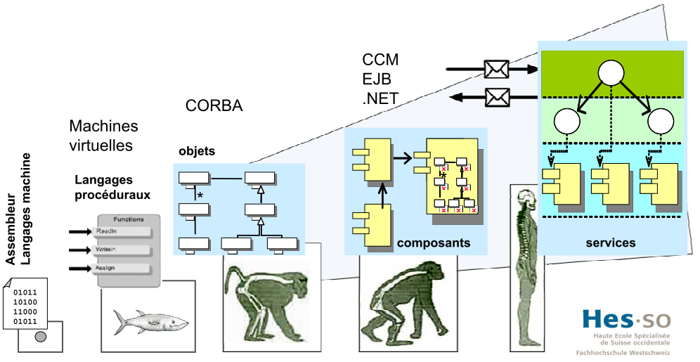
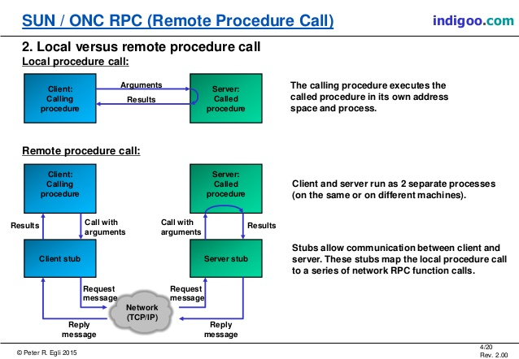
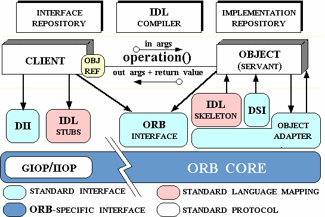
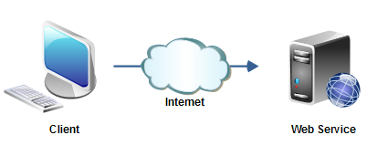
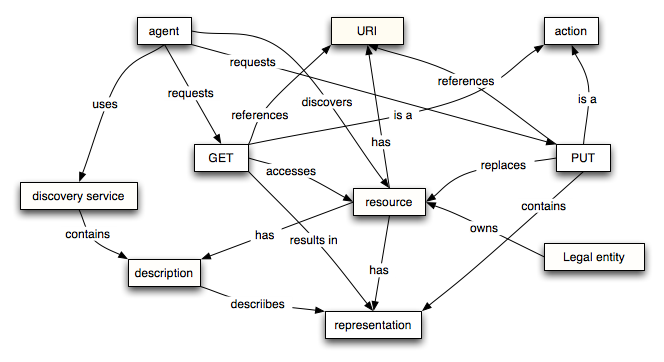
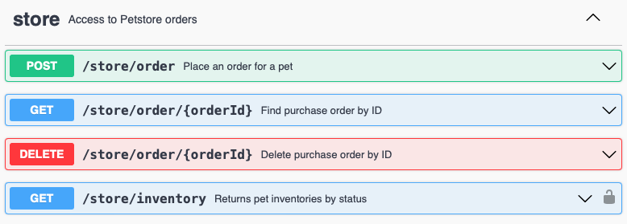
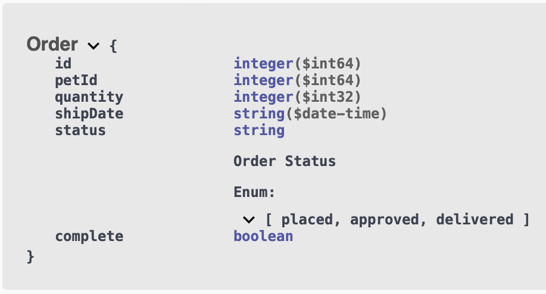
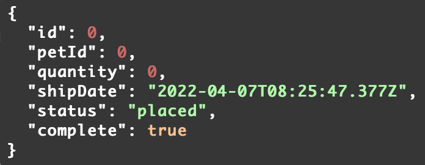

<!-- _paginate: skip -->
# Services webs et protocoles associés

<br>


<!-- _footer: <span class='red'>*</span> M. PERREIRA DA SILVA -->

---

<!-- _paginate: skip -->
# [Version PDF des slides](pdf/services-web.pdf)

---

# Introduction

- Oublions le web quelques instants...

- Parlons programmation et architecture logicielle

  + Ne **pas réinventer la roue** à chaque programme

  + **"Industrialiser"** le développement (ex: sous traitance)
    - Énormes logiciels d’entreprise

  + Besoin de **réutilisation**
    - Du code : Programmation orientée objet (POO)
    - Des fonctionnalités : **Programmation orientée composant** (POC)

---

# Évolution du niveau d'abstraction



---

# Composant ?

- Entité **indépendante**, fournissant une **fonctionnalité**
  
  + **Interface** de communication prédéfinie
  + Documentation séparée
  + Tests séparés

- **Programmation orientée composant** = assemblage de différents composants
  
  + Différentes provenances
  + Différents langages (objets ou non)

---

# Composants et architecture "locale"

- Les composants résident **sur une même machine**

- Besoin d'une plateforme de gestion de composants
  + Component Object Model (COM): OCX, ActiveX (Microsoft)
  + XPCOM: modèle de composant de Mozilla
  + Etc.

- Définition de l'**interface du composant** via un langage
  + **IDL:** Interface Description Langage (équivalent du .h en C)
  + Gestion de l'hétérogénéité des types dans les différents langages

---

## Composants et architectures "distribués"

- Architecture **distribuée**
  + Les composants peuvent être sur différents ordinateurs
  + Appels de méthode / procédures distants
- Contraintes complémentaires
  + Besoin d'un **protocole de communication** entre les composants
  + Besoin de **sérialiser / désérialiser** les données sur le réseau
    - Binaire
    - Texte
  + Besoin de **détection et description** des composants sur le réseau
- Exemples:
  + DCOM: version distribuée de COM (Microsoft)
  + CORBA: standard industriel (OMG)
  + .Net Remoting
  + Java Entreprise Edition (JEE) et les Entreprise Java Bean (EJB)

---

# Zoom sur quelques technologies d'architectures distribuées


---

# [ONC RPC](http://tools.ietf.org/html/rfc5531) : rudimentaire

- Standard (RFC 1057 & 5531) d'**appel de procédures à distance** via
  + Numéro de programme (attribué par l'IANA)
  + Numéro de version du programme (ex: 1)
  + Numéro de procédure

- Données et procédures représentées via le langage **XDR/RPC** (External Data Representation)
  + **1 seul paramètre** envoyé / retourné
  + Besoin de **définir des structures de données**

- Code écrit dans n'importe quel langage ayant une libraire RPC (ex: C)

- Données sérialisée (en **binaire**) et envoyées via les protocoles **TCP ou UDP**

- Plutôt dédié aux appels distants sur réseau local (**LAN**)

---

# ONC RPC: déroulement d'un appel



---

<!-- _class: bonus  -->

# [Corba](http://www.corba.org/): "standard" industriel (OMG)

- Composants **orientés objet** (héritage, etc.)

- Principe de l'**ORB** (Object Request Broker): sert d'intermédiaire de communication entre les différents objets / composants

- Description de l'interface des objets via le **langage IDL**
  + Syntaxe proche du C++
  + Traduction automatique de l'interface vers un squelette C++,Python, Java, etc.

- Fourniture de différents services
  + Nommage: retrouver un objet à partir de son nom
  + Courtage: retrouver un objet à partir de ses propriétés
  + etc.

- Communication entre les ORB via les protocoles **GIOP** (LAN) ou **IIOP** (Internet)

---

<!-- _class: bonus  -->

# Corba : Architecture



---

<!-- _class: bonus  -->

# RMI et .Net Remoting (WCF)

## RPC Java et .Net

- Appels de procédure distant **spécifiques**

- Fonctionne sur **HTTP** (compatibilité) ou **TCP** (performance)

- Basé sur la **sérialisation des objets**

- Protocole de **transmission** des messages
  
  + RMI: JRMP (spécifique JVM), IIOP (CORBA)
  + .Net WCF: SOAP, XML, JSON, RSS, Binaire

- WCF est un peu plus que du simple RPC
  
  + Architecture orienté service, comme les EJB Java

---

<!-- _class: bonus  -->

# [Entreprise Java Bean](http://www.oracle.com/technetwork/java/javaee/ejb/index.html) (EJB)

- Architecture de **composants distribués** Java

- 3 types de composants (beans):
  
  + EJB entité: représente des données (généralement persistantes)
    - Mapping objet / relationnel avec une base de données
  + **EJB session**: service = mise à disposition d'un certain nombre de méthodes
    - Stateless Session Bean: pas de conservation de l'état entre les appels
    - Stateful Session Bean: état conservé entre les appels
  + EJB message: réalisation de tâches asynchrones

- Fonctionne sur un **serveur d'application**

---

<!-- _class: bonus  -->

# EJB: exemples de "Session Bean"

```java
@Stateless // Bean stateless
public class StatelessSessionBeanImpl implements StatelessSessionBean {                      
// l'interface StatelessSessionBean sera utilisée coté client
    public int doubleUnEntier( int unEntier) {
        return unEntier*2;
    }
}
```

```java
@Stateful // Bean statefull
public class StatefulSessionBeanImpl implements StatefulSessionBean {                       
// l'interface StatefulSessionBean sera utilisée coté client
    private int nombre=0;

    public void init(int nombre) {
        this.nombre = nombre;
    }

    public String doubleEntierPrecedent() {
        if (nombre == 0) {
            return 1;
        }
        nombre *= 2;
        return nombre;
    }
}
```

---

# Les serveurs d'application

- **Hébergent les composants** et gèrent leur cycle de vie

- Fournissent d'**autres services**
  + Lien avec serveur web
  + Lien avec SGBD
  + Administration des composants

- Généralement **spécifiques à une technologie**
  + Java EE: JBOSS, Apache TomEE, Oracle GlassFish
  + .Net: intégré au framework .Net
  + PHP: Zend Server
  + Python: Zope

---

# Services web


---

# C'est quoi ?

- Un service Web est une **application logicielle** accessible à partir du **web**. Il utilise les **protocoles internet** pour communiquer et utilise un **langage standard** pour décrire son interface



- Quelle différence avec un site web ?
  + La **présentation** des informations est inutile (HTML)

---

# La définition du W3C

> Un service web est un **système logiciel** identifié par **un URI**, dont les interfaces publiques et les « bindings » sont définies et décrites en **XML**<span class='red'>*</span>. Sa définition peut être **découverte** [dynamiquement] par d’autres **systèmes logiciels**. Ces autres systèmes peuvent ensuite interagir avec le service web d’une façon décrite par sa définition, en utilisant des **messages XML** transportés par des **protocoles Internet**]

<!-- _footer: <span class='red'>*</span> Le W3C met en avant XML comme langage de description (à différents niveaux). Mais ce n'est pas le seul moyen (standard) de communication... -->

---

# Exemples...

- Nombreuses **API** disponibles sur le web
  
  + Google: https://developers.google.com/apis-explorer (REST)
  + X: https://docs.x.com/x-api/ (REST)
  + Facebook: https://developers.facebook.com/ (REST)
  + Paypal: https://developer.paypal.com/api/rest/ (REST)
  + Salesforce: https://developer.salesforce.com/docs/atlas.en-us.api.meta/api/ (SOAP)

- Accès à ces API via les protocoles de service web (SOAP, REST, etc.)

  ou

- Via des kit de développement (SDK) spécifiques (JavaScript, Java, etc.)
  + Les SDK ne font que simplifier l'accès au service web

---

# Les formats d'échange de données web


---

# [XML](http://www.w3.org/XML/)

- **Extensible Markup Language**

- Vu dans les cours précédents (*Remi Lehn*)

- Langage de **description** de données

- On peut **créer de nouveaux langages** via un Schéma XML

- On peut **transformer** un document XML vers d'autres formats (XML ou non) via XSLT

- La base de nombreux services web

- **Attention:** format particulièrement *verbeux*

---

# [JSON](http://json.org/)

- Format de description de données textuel
  + Existe en version binaire ([BSON](http://bsonspec.org/))

- Dérivé de la **notation objet de JavaScript**

- Ne contient que 2 types de structures
  + **Objet** = ensemble non ordonnée de paires `"clé" : valeur`
    - Ex: `{ "nom": "Polytech", "nbEtudiants: 500" }`
  + **Tableau** = collection ordonnée de valeurs
    - Ex: `[ 1, 2, 3, 4, 5]`

- Une **valeur** peut être:
  + Un objet
  + Un tableau
  + Un type simple (chaine, nombre, booléen, null)

---

# XML vs. JSON: exemple

<div class='pure-g'>
<div class='pure-u-1-2'>

XML

```xml
<product>
     <id>15</id>
     <name>Widgets</name>
     <description>These widgets are the finest 
     widgets ever made by anyone.</description>
     <options type="color">
          <item>Purple</item>
          <item>Green</item>
          <item>Orange</item>
     </options>
</product>
```

</div>
<div class='pure-u-1-2'>

JSON

```json
"product" : {
     "id" : 15,
     "name" : "Widgets",
     "description" : "These widgets are the finest 
     widgets ever made by anyone.",
     "options" : [
          {
               "type" : "color",
               "items" : [
                    "Purple",
                    "Green",
                    "Orange"
               ]
          }
    ]
}
```

</div>
</div>

---

# Architectures (web) orientées service


---

# [XML-RPC](http://xmlrpc.scripting.com/)

- **Appel de procédure distant** (RPC) avec

  + **Transport** des messages via HTTP
    - **Requête `POST`**

  + **Encodage** des messages via **XML** dans le **corps de la requête**
    - Un seul élément `<methodCall>` par requête
    - L'élément fils `<methodName> définit la méthode à appeler`
    - Les paramètres sont passés dans l'élément `<params>` via des balises `<param>`

  + On peut passer en **paramètre / résultat**
    - Des types simples (entier, flottant, booléen, chaine, date, données binaires en Base64)
    - Des tableaux
    - Des structures

  + La réponse ne peut contenir **qu'une seule balise `<param>`**

---

# [XML-RPC](http://xmlrpc.scripting.com/)

- **Avantage**:
  
  + Simple

  + Indépendant du langage de programmation (Java, PHP, etc.)

  + Utilise des protocoles et langages standards

- **Limitations** :
  
  + Types de données limités

  + Assez verbeux (XML...)

---

# XML-RPC: exemple

<div class='pure-g'>
<div class='pure-u-1-2'>

Requête

```xml
POST /ExempleRPC HTTP/1.0
User-Agent: Frontier/5.1.2 (WinNT)
Host: test.polytech.univ-nantes.fr
Content-Type: text/xml
Content-length: 181

<?xml version="1.0"?>
<methodCall>
   <methodName>example.doubleUnEntier
   </methodName>
   <params>
      <param>
         <value><int>41</int></value>
         </param>
      </params>
   </methodCall>
```

</div>
<div class='pure-u-1-2'>

Réponse

```xml
HTTP/1.1 200 OK
Connection: close
Content-Length: 158
Content-Type: text/xml
Date: Fri, 17 Jul 2014 19:55:08 GMT
Server: UserLand Frontier/5.1.2-WinNT

<?xml version="1.0"?>
<methodResponse>
   <params>
      <param>
         <value><int>82</int>
         </value>
         </param>
      </params>
   </methodResponse>
```

</div>
</div>

---

# [JSON-RPC](http://www.jsonrpc.org/)

- **Très similaire** à l'esprit **XML-RPC**

  + Simple

  + Lisible par un humain

- Mais...

  + Remplacement de XML par **JSON** (plus compact)

  + Codage **Unicode** par défaut

  + **Indépendant du protocole** (HTTP(S), TCP/IP, etc.)

  + Support des **notifications** (message n'attendant pas de réponse)

---

# [JSON-RPC](http://www.jsonrpc.org/)

- Membres d'un **objet requête**
  + `jsonrpc`: version du protocole utilisé (actuellement "2.0")
  + `method`: nom de la méthode à appeler
  + `params` (optionnel): structure de données contenant les paramètres à passer à la méthode
    - On ne passe qu'une structure
  + `id`: identifiant de la requête (nombre ou chaine de caractère), qui sera également utilisé par la réponse.
    - Si l'`id` est NULL, alors la requête est une notification

- Membres d'un **objet réponse**
  + `jsonrpc` et `id`: identique aux champs de la requête
  + `result`: valeur de retour de la méthode. Ne doit pas être présent en cas d'erreur.
  + `error`: objet décrivant l'erreur ayant eu lieu. Ne doit être présent que en cas d'erreur.

---

# Exemple JSON-RPC

Requête / réponse basique

```json
{"jsonrpc": "2.0", "method": "doublerUnEntier", "params": 1789, "id": "request-1"}
```

```json
{"jsonrpc": "2.0", "result": 3578, "id": "request-1"}
```

Requête / réponse  simple

```json
{"jsonrpc": "2.0", "method": "majPersonne", "params": { "nom": "Robert", "age": 57,
 "Classement": [1,2,6,2,1] }, "id": "request-2"}
```

```json
{"jsonrpc": "2.0", "result": "Ok", "id": "request-2"}
```

En cas d'erreur

```json
{"jsonrpc": "2.0", "error": {"code": -32601, "message": "Method not found"}, "id": "request-2"}
```

---

# Service web (SOAP): architecture

.ppt.pdf")

---

# Les 3 briques d'un service web

- **Annuaire** (Service Registry)
  + Annuaire des services publiés par les providers (UDDI)
  + Géré sur un serveur niveau application, entreprise ou mondial

- **Service Provider**
  + Application s'exécutant sur un serveur et comportant un module logiciel accessible en XML

- **Service Requester**
  + Application cliente se liant à un service et invoquant ses fonctions par des messages XML (REST, XML-RPC,SOAP)

---

# Les langages et protocoles standards

- **WSDL** (Web Services Description Language) donne la **description** au format XML des Web Services en précisant les méthodes pouvant être invoquées, leur signature et le point d'accès (URL, port, etc..).
  + Dialecte XML permettant de décrire un web service

- **UDDI** (Universal Description, Discovery and Integration) normalise une solution d'**annuaire distribué** de Web Services, permettant à la fois la publication et l'exploration. UDDI se comporte lui-même comme un Web service dont les méthodes sont appelées via le protocole SOAP.
  + Annuaire permettant d’enregistrer et de rechercher des service web

- **SOAP** (Simple Object Access Protocol) : Protocole de **communication** des services Web par échange de message XML.

---

# [SOAP](http://www.w3.org/TR/soap12-part0/)

- Protocole de **communication** de messages

- N'est **pas lié** à un protocole de **transport** particulier (mais HTTP est populaire)

- Un message SOAP est composé de
  + Une **déclaration** XML (optionnelle), suivie de
  + Une **enveloppe** SOAP (l'élément racine) qui est composée de:
    - Un Entête SOAP (optionnel)
    - Un Corps SOAP : dont le contenu dépend de l'application
      - Peut contenir des messages d'erreur et pièces jointes

- Un dialogue SOAP contient un message de **requête** et un message de **réponse**

---

# SOAP

## Exemple de dialogue simpliste

Requête: appel d'une méthode qui double la valeur d'un entier

```xml
<?xml version="1.0" encoding="UTF-8" standalone="no" ?>
  <SOAP-ENV:Envelope
   SOAP-ENV:encodingStyle="http://schemas.xmlsoap.org/soap/encoding/"
   xmlns:SOAP-ENV="http://schemas.xmlsoap.org/soap/envelope/"
   xmlns:SOAP-ENC="http://schemas.xmlsoap.org/soap/encoding/"
   xmlns:xsi="http://www.w3.org/1999/XMLSchema-instance"
   xmlns:xsd="http://www.w3.org/1999/XMLSchema">
    <SOAP-ENV:Body>
        <ns1:doublerUnEntierReq
         xmlns:ns1="urn:MonServiceSOAP">
            <param1 xsi:type="xsd:int">1024</param1>
        </ns1:doublerUnEntierReq>
    </SOAP-ENV:Body>
  </SOAP-ENV:Envelope>
```

---

# SOAP (exemple dialogue)

## Exemple de dialogue simpliste

Réponse: la valeur de l'entier doublé...

```xml
<?xml version="1.0" encoding="UTF-8" ?>
  <SOAP-ENV:Envelope
   xmlns:SOAP-ENV="http://schemas.xmlsoap.org/soap/envelope/"
   xmlns:xsi="http://www.w3.org/1999/XMLSchema-instance"
   xmlns:xsd="http://www.w3.org/1999/XMLSchema">
    <SOAP-ENV:Body>
        <ns1:doublerUnEntierRep
         xmlns:ns1="urn:MonServiceSOAP"
         SOAP-ENV:encodingStyle="http://schemas.xmlsoap.org/soap/encoding/">
            <return xsi:type="xsd:int">2048</return>
        </ns1:doublerUnEntierResp>
    </SOAP-ENV:Body>
  </SOAP-ENV:Envelope>
```

---

# [WSDL](http://www.w3.org/TR/wsdl)

- Document XML **décrivant un service web**

- Définition du service via 7 éléments principaux
  + `<types>`: **définition des données** utilisées par le service web
  + `<message>`: définition de la **structure d'un message** en lui attribuant un nom et en décrivant les éléments qui le composent (nom + type)
  + `<portType>`: Description de toutes les **opérations proposées** par le service web (interface du service) et identification de cet ensemble avec un nom
  + `<operation>`: **Description d'une action** proposée par le service web notamment en précisant les messages requêtes et réponses
  + `<binding>`: **Description du protocole** de transport et d'encodage utilisé par un `<portType>` afin de pouvoir invoquer un service web
  + `<port>` : Référence un `<binding>` (généralement c'est l'url d'invocation du service web)
  + `<service>` : Un ensemble de ports

---

# WSDL : exemple

```xml
<?xml version="1.0" encoding="UTF-8" ?>
<definitions targetNamespace="http://polytech.univ-nantes.fr/exemple-wsdl.wsdl"
xmlns:apachesoap="http://xml.apache.org/xml-soap"
xmlns:impl="http://polytech.univ-nantes.fr/exemple-wsdl.wsdl"
xmlns:soapenc="http://schemas.xmlsoap.org/soap/encoding/"
xmlns="http://schemas.xmlsoap.org/wsdl/"
xmlns:soap="http://schemas.xmlsoap.org/wsdl/soap/"
xmlns:xsd="http://www.w3.org/2001/XMLSchema">
    <message name="doublerUnEntierReq">
        <part name="valeur" type="xsd:int" />
    </message>
    <message name="doublerUnEntierRes">
        <part name="doublerRetour" type="xsd:int" />
    </message>
    <portType name="Calculer">
        <operation name="doublerUnEntier" parameterOrder="valeur">
            <input message="impl:doublerUnEntierReq" name="doublerUnEntierReq" />
            <output message="impl:doublerUnEntierRes" name="doublerUnEntierRes" />
        </operation>
    </portType>
```

---

# WSDL : exemple

```xml
    <binding name="CalculerSoapBinding" type="impl:Calculer">
        <soap:binding style="rpc" transport="http://schemas.xmlsoap.org/soap/http" />
        <operation name="additionner">
            <soap:operation soapAction="" />
                <input name="doublerUnEntierReq">
                    <soap:body encodingStyle="http://schemas.xmlsoap.org/soap/encoding/" 
                    namespace="urn:MonServiceSOAP" use="encoded" />
                </input>
                <output name="doublerUnEntierRes">
                    <soap:body encodingStyle="http://schemas.xmlsoap.org/soap/encoding/" 
                    namespace="urn:MonServiceSOAP" use="encoded" />
                </output>
            </operation>
        </binding>
    <service name="CalculerService">
        <port binding="impl:CalculerSoapBinding" name="Calculer">
            <soap:address location="http://localhost:8080/ExempleWS/services/Calculer" />
        </port>
    </service>
</definitions>
```

---

# UDDI

- UDDI permet la **découverte et la description** des services web

- Un annuaire UDDI comporte 3 composants :
  + Les **pages blanches**: comprennent la **liste des entreprises** ainsi que des informations associées à ces dernières.
  + Les **pages jaunes**: recensent les **services Web** de chacune des entreprises sous le standard WSDL.
  + Les **pages vertes**: fournissent des **informations techniques précises** sur les services fournis. Ces informations concernent les descriptions de services et d'information de liaison ou encore les processus métiers associés.

- Pas aussi largement utilisé qu'espéré
  + IBM, Microsoft et SAP hébergeaient des annuaires UDDI publics il y a quelques années...
  + Les annuaires UDDI sont plutôt privés (inter entreprise)

---

<!-- _class: bonus  -->

# [JSON-WSP](http://en.wikipedia.org/wiki/JSON-WSP) (Abandonné...)

- **Alternative aux services web SOAP**, pas encore standardisée
  + RFC en cours...

- Comble les lacunes de JSON-RPC en terme de **description de service** (types et méthodes)
  + Équivalent de SOAP + WSDL

- Utilise des **requêtes HTTP `POST`** pour le transport (comme XML-RPC)

- Fonctionnement des requêtes / réponses / erreurs **très proche de JSON-RPC**
  + Champs `methodName`, `args`, `result`

- Ajout d'un objet de **description** des types et méthodes
  + Déclaration de **structures de données** complexes
  + **Documentation** des types et des méthodes
  + Possibilité de déclarer des fichiers (**attachement**) comme type de donnée

---

<!-- _class: bonus  -->

# JSON-WSP: exemple (1/2)

Description (ici on ne définit qu'une méthode, pas de type)

```json
{   "type": "jsonwsp/description",
    "version": "1.0",
    "servicename": "MonService",
    "url": "http://polytech.univ-nantes.fr/test-JSON-WSP",
    "methods": {
        "doubleUnEntier": {
            "doc_lines": ["Renvoie le double d'un entier !"],
            "params": {
                "unEntier": {
                    "def_order": 1,
                    "doc_lines": ["Le nombre que l'on veut doubler"],
                    "type": "number",
                    "optional": false
                }
            },
            "ret_info": {
                "doc_lines": ["L'entier doublé"],
                "type": "number"
            }
        }
    }
}
```

---

<!-- _class: bonus  -->

# JSON-WSP: exemple (2/2)

Requête

```json
{   "type": "jsonwsp/request",
    "version": "1.0",
    "methodname": "doubleUnEntier",                                                               
    "args": {
        "unEntier": 3615
    },
    "mirror": {
        "id": 1234
    }
}
```

Réponse

```json
{
    "type": "jsonwsp/response",
    "version": "1.0",
    "servicename": "MonService",
    "method": "doubleUnEntier",                                                                
    "result": 7230,
    "reflection": {
        "id": 1234
    }
}
```

---

# Architectures orientées ressources



---

# REST ?

- REST: **REpresentational State Transfer**

- **Style d’architecture** != protocole de communication (SOAP)

- Décrit en 2000 par Roy Thomas Fielding dans sa thèse, chap 5, "Architectural Styles and the Design of Network-based Software Architectures"
  + 1 des principaux acteur de la spécification de HTTP
  + Membre fondateur de la fondation Apache
  + Développeur du serveur Web Apache

- Style d’architecture **inspiré du Web**

- Architecture **orientée ressource**

---

# REST ?

- Utilisé pour développer des **Services Web**

- Dans la littérature
  + Architectures orientées **ressources** (ROA)
  + Architectures orientées **données** (DOA)

- Quand une application respecte ces principes: **RESTFul**

- Les services web REST sont **sans états** (Stateless)
  + Pas de mémoire des requêtes antérieures
  + Chaque requête envoyée doit contenir toutes les informations nécessaires au traitement

---

# Les concepts de REST

- **Ressources** (Identifiant)
  + Identifiée par une URI
  + Exemple (fictif): http://www.achats.fr/livre/SF/Harry-Potter

- **Méthodes** (Verbes)
  + Action à effectuer sur la ressource
  + Méthodes HTTP: `GET`, `POST`, `PUT` et `DELETE`

- **Représentation** (Vue de la ressource ou de son état)
  + Informations échangées avec le service
  + Texte, XML, JSON, ...

---

# REST: Ressource

- Tout ce qui est **identifiable / manipulable** dans le système
  + Document, Image, Personne, Le montant du compte d’un client, etc.

- **Identifié par un lien** (URI)

- Une ressource **peut avoir plusieurs URI**

- Une URI identifie **une seule ressource** (ou un seul groupe de ressources)

- Construite de façon **hiérarchique**

- La représentation d’une ressource **peut évoluer avec le temps**
  + Lié au temps: ex. Dernier article
  + Modification structure: ex. Ajout d’un champ

---

# REST: Ressource

- Structure classique
  + Structure **hiérarchique**
  + Construction classique
    - `http://domaine.com/<plus général>/../<plus spécifique>`

- Exemples d’URIs
  + /musique/rock
  + /musique/rock/AC-DC/
  + /musique/rock/AC-DC/année
  + /musique/rock/AC-DC/back_in_black
  + /musique/rock/AC-DC/année/5
  + /musique/classique/meilleures_ventes
  + /musique/recherche/foxy_lady

---

# REST: Ressource

- On peut aussi utiliser la **chaîne de requête**
  - Préciser la demande de ressource
  - Utiliser et combiner des critères non hiérarchiques
  
- Exemples
  + Uniquement les dix premiers résultats
    + /music/rock?limit=10
  + Trie par ordre ascendant ou descendant sur un champ particulier
    + /music/rock/AC-DC?sort=asc&sortby=year
  + Format (possible aussi via entête `Accept`)
    + /music/classical/best_sellers?format=json

---

# REST: Interface / méthodes

- REST fournit une interface uniforme
- Chaque ressource peut subir **4 opérations de base** (CRUD)
  + Create (Créer)
  + Retrieve (Lire)
  + Update (MAJ)
  + Delete (Supprimer)
- REST **s’appuie sur HTTP** pour exprimer les opérations via les méthodes HTTP
  + `POST` (Créer)
  + `GET` (Lire)
  + `HEAD` (Lire les métadonnées)
  + `PUT` (MAJ complète) + `PATCH` (MAJ partielle)
  + `DELETE` (Supprimer)
- Il n'est pas nécessaire d'implémenter toutes les méthodes pour une ressource

---

# REST: Représentation

- **Format d’échange** des données
  + Pour le client (`GET`)
  + Pour le serveur (`PUT`, `POST` ou `PATCH`)

- Généralement: Texte, JSON, XML, HTML, CSV

- Le format d’entrée (`POST`) et de sortie (`GET`) d’une même ressource peut varier

- On peut spécifier le format via
  + **Entêtes HTTP** (type MIME via `content-type`)
  + **L'URL** de la ressource 
    - directement (`/musique/rock/xml` ou `/musique/rock/json`)
    - via la chaine de requête (`/musique/rock?format=xml` ou `/musique/rock?format=json`)

---

# REST: Limites

- **Actions binaires**:
  + Demander si un artiste fait partie d'un groupe ?
  + Demander si un groupe contient un artiste ?
  + Plus dur : lien entre groupe et artiste lors de la création ?
- **Transactions**
  + Décrire un virement bancaire ?
  + Créer une ressource incrémentalement ?
- Les URI doivent-elles être **évidentes ou opaques** ?
  + Donnée: `/serveur/home/~maurice/` ("joli", mnémotechnique)
  + Identifiant: `/homedir/23eab89c/` (résistant au changement)
- **Sécurité**
  + Authentification HTTP simple
  + Utilisation d'HTTPS, cookies, tokens, etc.

---

# Spécification d'une API RESTFul

- Exemple via l'outil [Swagger.io](https://swagger.io) : [Animalerie](https://petstore.swagger.io) (Petstore)

- Spécifications des opérations réalisables sur la ressource magasin (store)



---

# Spécification d'une API RESTFul

- Modèle de données d'une commande

<div class='pure-g'>
<div class='pure-u-1-2'>

Modèle



</div>
<div class='pure-u-1-2'>

Exemple JSON



</div>
</div>

---

# Service vs. ressource

- Modèle d'interaction :
  + SOAP : **Échanges**
    - Le serveur conserve des données sur la session
    - Les messages ne contiennent que ce qu'ils expriment
  + REST : **Opérations indépendantes**
    - Serveur sans état
    - Les messages doivent embarquer le contexte

- Cible :
  + SOAP : plutôt des **services transactionnels** (ex: réservation de billet)
  + REST : plutôt des échanges de **données / documents** (ex: tweets)

---

# Service vs. ressource

- Protocole :
  + SOAP: **subit HTTP**
    - Indépendant du transport donc d'HTTP, mais la large majorité des échanges passe par HTTP
    - Propre modèle de sécurité
    - Propre retour des erreurs
    - Propre stratégie de cache
  + REST: **épouse HTTP**
- Formats :
  + REST: **s'adapte** aux capacités du client (négociation de contenu)
  + WSDL: **définit finement** les formats des données échangées
- Documentation :
  + REST : **pas de norme**, mais [possible depuis WSDL 2.0](https://www.ibm.com/developerworks/library/ws-restwsdl/)
  + WSDL : **définit finement** (mais verbeusement) les échanges

---

# SOAP vs. REST : conclusion

| REST                                    | SOAP                                    |
| --------------------------------------- | --------------------------------------- |
| Suppose une communication point à point | Gère les environnements distribués      |
| Ne nécessite qu'un serveur HTTP         | Nécessite des outils / middleware       |
| Pas de description des services         | WSDL                                    |
| Ne fonctionne que via HTTP              | Différents types de transport possibles |
| Peu verbeux                             | Très verbeux                            |
| Pas Standard                            | Standard                                |
| Simple, peu de fonctionnalités gérées   | Plus complexe, mais plus complet        |

---

# C'est fini...


